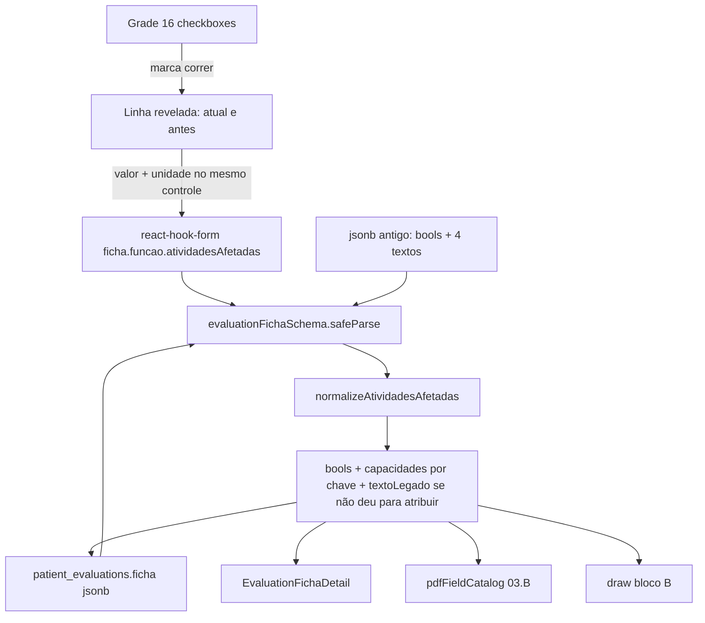

# Phase 24: Atividades da avaliação - Research

**Researched:** 2026-10-04
**Domain:** Bloco B da página 03 · Função (`ficha` jsonb) — várias atividades, capacidade atual, quanto conseguia antes, unidade
**Confidence:** HIGH

<user_constraints>
## User Constraints (from CONTEXT.md)

### Locked Decisions
### Várias atividades
- No bloco B dá para registrar mais de uma atividade. O profissional escolhe uma (exemplo: correr), preenche o quanto consegue agora e o quanto conseguia antes, e depois adiciona outra (exemplo: agachar) com as próprias informações.

### Um bloco de capacidade
- Juntar Consigo por e Capacidade atual. Ficam só **capacidade atual** e **quanto conseguia antes**.
- Tirar o campo de texto **Atividade**. A atividade já está marcada em cima.

### Unidade de medida
- Em capacidade atual e em quanto conseguia antes dá para escolher uma unidade. Exemplos travados: minutos, km, repetições.
- O par valor + unidade fica formatado de forma clara, não como dois textos soltos.

### Claude's Discretion
- Como adicionar a próxima atividade (marcar na grade e abrir uma linha, ou um botão Adicionar), desde que cada atividade tenha o próprio par atual/antes.
- Como desenhar o seletor de unidade (lista, chips), desde que minutos, km e repetições existam e o layout fique limpo.
- Como gravar no `ficha` jsonb e como ler fichas antigas que ainda têm um único `capacidadeAtual` / `consigoPor` / `atividade`.
- Como o PDF e o catálogo de export mostram a lista nova.

### Deferred Ideas (OUT OF SCOPE)
Nenhuma seção Deferred Ideas no CONTEXT.md.

Fora de escopo pelo boundary e pelo brief: blocos A, C–F; páginas 01, 02 e 04; EVA; metas/objetivos novos; pacote npm novo; SQL; `supabase db push`; prompt e pack da função `patient-ai-summary`.
</user_constraints>

<phase_requirements>
## Phase Requirements

| ID | Description | Research Support |
|----|-------------|------------------|
| REQ-35 | No bloco B de 03 Função, cada atividade marcada tem a própria capacidade atual e quanto conseguia antes, com unidade (minutos, km, repetições). Some o campo Atividade e o Consigo por. Leitura, PDF e catálogo mostram valor e unidade. | Grade atual permanece o seletor; a linha de medida abre ao marcar. Mapa `capacidades` por chave do catálogo, normalizado no Zod na leitura. `formatMedida` único alimenta detalhe, catálogo `03.B` e desenho do PDF. Sem SQL. Sem mudança na função de resumo IA. |
</phase_requirements>

## Summary

O bloco B já é uma grade de 16 booleanos (`caminhar` … `outra`) mais quatro textos compartilhados (`capacidadeAtual`, `atividade`, `consigoPor`, `antesConseguiaPor`). A grade é o seletor que a decisão travada manda manter (“a atividade já está marcada em cima”). O encaixe menor é **marcar na grade e revelar a linha daquela atividade**, não um `useFieldArray` com botão Adicionar. A página 04 já tem linhas repetíveis para mobilidade e força; copiar esse padrão aqui criaria um segundo seletor de atividade e contradiria a decisão.

A gravação continua no `patient_evaluations.ficha` jsonb, sem coluna nova. O Zod 3.25.76 do projeto **apaga chaves desconhecidas** no `safeParse` que o serviço já faz na leitura e no save. Trocar o objeto sem um `preprocess` apaga `capacidadeAtual` / `consigoPor` / `antesConseguiaPor` no próximo salvamento, e um `safeParse` que falhe derruba a ficha inteira (não só o bloco B). A normalização tem de ser pura, nunca lançar, e devolver só o que o schema novo aceita — inclusive o texto antigo quando não dá para saber a qual atividade o número pertencia.

**Primary recommendation:** Manter os 16 booleanos como seletor. Guardar `{ atual: { valor, unidade }, antes: { valor, unidade } }` num mapa `capacidades` com a mesma chave. Unidades fechadas e independentes (`minutos` | `km` | `repeticoes`), valor e unidade no mesmo controle. Normalizar ficha antiga dentro do schema. Uma função pura formata a linha para detalhe, catálogo e PDF. Não mexer na função de IA.

## Project Constraints (from phase brief)

Não há `.cursor/rules/` neste repositório. O brief da fase manda:

- SQL Editor só se o schema mudar. A ficha já é jsonb — não gerar SQL. Nunca `supabase db push`.
- UI em português.
- Nenhum pacote npm novo.
- Esconder controles de escrita quando `!canWrite` / `readOnly`.
- Não inventar EVA nem metas.

O editor da avaliação só monta com `canWrite` (`PatientEvaluationPanel`). Os inputs do bloco B mesmo assim recebem `disabled={readOnly}`, no mesmo padrão da página 03.

## Architectural Responsibility Map

| Capability | Primary Tier | Secondary Tier | Rationale |
|------------|-------------|----------------|-----------|
| Escolher atividade e preencher valor + unidade | Browser / Client | — | A grade e os controles vivem em `EvaluationPage03`. Não há endpoint novo. |
| Validar e migrar o objeto antigo | Browser / Client | — | `evaluationFichaSchema.safeParse` já roda em `evaluations.service.ts` na leitura e no `toRow`. O `preprocess` mora nesse schema. |
| Persistir a lista | Database / Storage | Browser / Client | Coluna `ficha jsonb` já existe. O cliente grava o objeto parseado. Sem migração SQL. |
| Leitura da ficha salva | Browser / Client | — | `EvaluationFichaDetail` hoje não mostra o bloco B. REQ-35 pede essa leitura. |
| Catálogo e desenho do PDF | Browser / Client | — | `buildEvaluationFilledCatalog` e `patientAiPdf.service.ts` leem a `EvaluationFicha` já parseada. |
| Resumo IA | — | — | Fora de escopo. A função não lê `ficha`. |

## Standard Stack

### Core

| Library | Version | Purpose | Why Standard |
|---------|---------|---------|--------------|
| zod | 3.25.76 (instalado) | Schema da ficha + `preprocess` da forma antiga | Já valida `ficha` no save e na leitura. Não subir para Zod 4. |
| react-hook-form | 7.81.0 | Grade e campos do bloco B | A página 03 já usa `register` / `watch`. O editor fixa `shouldUnregister: false`. |
| @hookform/resolvers | 5.4.0 | `zodResolver(evaluationFormSchema)` | Já liga o form ao schema. Sem resolver novo. |
| pdf-lib | 1.17.1 | Desenho do bloco B no PDF | `drawOptionalField` / `drawFichaBlockFrame` já desenham o 03.B. |

### Supporting

| Library | Version | Purpose | When to Use |
|---------|---------|---------|-------------|
| `node:test` + `node:assert/strict` | Node v26.4.0 | Teste da normalização e do `parse` antigo/novo | Helper puro, import relativo com `.ts`. Sem Vitest. |

### Alternatives Considered

| Instead of | Could Use | Tradeoff |
|------------|-----------|----------|
| Grade que revela a linha | `useFieldArray` + botão Adicionar (como mobilidade na página 04) | O array guarda ordem de clique e aceita duplicata. Exige um segundo seletor. A decisão travada diz que a atividade já está marcada na grade de cima. |
| Mapa `capacidades[chave]` | Array `{ key, atual, antes }` | O array não impede duas vezes a mesma chave e obriga índice no `register`. O catálogo é fechado (16 chaves). O mapa é 1:1 com o booleano. |
| Unidades independentes | Uma unidade só para o par atual/antes | Menos controles, mas o texto travado dá escolha de unidade em cada capacidade. |
| Enum fechado de 3 | Unidade livre | Texto livre de unidade volta a ser “dois textos soltos”, que a decisão rejeita. |
| Zod 4.6.5 (registry hoje) | Ficar no 3.25.76 | Subir o major quebra o schema inteiro da ficha. Fora de escopo. |

**Installation:**

```bash
# nenhum pacote — zod, react-hook-form e pdf-lib já estão no projeto
```

**Version verification:** `npm ls zod react-hook-form pdf-lib @hookform/resolvers --depth=0` → zod@3.25.76, react-hook-form@7.81.0, pdf-lib@1.17.1, @hookform/resolvers@5.4.0. `npm view zod version` devolve 4.6.5 no registry; não usar essa versão. [VERIFIED: npm ls / npm view neste workspace]

## Package Legitimacy Audit

Esta fase não instala pacote. O portão slopcheck não se aplica. Não adicionar Vitest, não adicionar biblioteca de máscara numérica, não adicionar seletor de unidade.

**Packages removed due to slopcheck [SLOP] verdict:** none
**Packages flagged as suspicious [SUS]:** none

## Architecture Patterns

### System Architecture Diagram



O profissional marca Correr, preenche a linha, marca Agachar, preenche de novo. Desmarcar apaga a capacidade daquela chave. O save e a releitura passam pelo mesmo `preprocess`, então uma ficha nunca reaberta já aparece na forma nova na UI, no detalhe e no PDF, sem `UPDATE` no banco.

### Recommended Project Structure

```text
src/lib/atividadeCapacidade.ts          # catálogo, unidades, normalize, formatMedida
src/lib/atividadeCapacidade.test.ts     # node:test REQ-35
src/schemas/evaluationFicha.schema.ts   # preprocess em funcao.atividadesAfetadas
src/components/patients/evaluation/EvaluationPage03.tsx   # só o bloco B
src/components/patients/evaluation/EvaluationFichaForm.tsx # passar setValue à página 03
src/components/patients/evaluation/EvaluationFichaDetail.tsx
src/lib/pdfFieldCatalog.ts              # preview 03.B
src/services/patientAiPdf.service.ts    # draw 03.B
```

Não criar SQL. Não editar `evaluations.service.ts`: `resolveEvaluationFicha` e `toRow` já chamam `evaluationFichaSchema.safeParse`. Não editar `patient-ai-summary`.

### Pattern 1: Grade revela a linha

**What:** Os 16 `BoolCheck` continuam em `ficha.funcao.atividadesAfetadas.<chave>`. Abaixo da grade, para cada chave com `watch(...) === true`, renderizar um bloco com o rótulo da atividade e dois controles de medida (capacidade atual, quanto conseguia antes). Ordem = ordem do catálogo (Caminhar … Outra), não a ordem dos cliques. “Depois adiciona agachar” é marcar o segundo checkbox, que revela a segunda linha.

**When to use:** Só no bloco B. `Outra (detalhe)` continua onde está, visível quando `outra` está marcado, e a linha de medida de Outra aparece junto.

**Example:**

```tsx
// Fonte: EvaluationPage03.tsx (grade atual) + EvaluationPage04.tsx (remover só quando !disabled)
{ATIVIDADES.map((item) =>
  watch(`ficha.funcao.atividadesAfetadas.${item.key}`) ? (
    <MedidaRow key={item.key} label={item.label} atividadeKey={item.key} disabled={disabled} />
  ) : null,
)}
```

Ao desmarcar, `setValue` zera `capacidades.<chave>`. O editor usa `shouldUnregister: false` (`PatientEvaluationEditorForm.tsx`), então o campo desmontado **continua no payload** se ninguém limpar. O `preprocess` também descarta capacidade cuja bool não é `true` — as duas camadas, UI e schema.

`EvaluationFichaForm` hoje não passa `setValue` para a página 03. Passar, como já faz com a página 02. Não passar `control` e não usar `useFieldArray`.

### Pattern 2: Mapa por chave, não array

**What:** Forma persistida depois do parse:

```ts
atividadesAfetadas: {
  correr: true,
  agachar: true,
  outraDetalhe?: string,
  textoLegado?: string,
  capacidades: {
    correr: {
      atual: { valor: '10', unidade: 'minutos' },
      antes: { valor: '40', unidade: 'minutos' },
    },
    agachar: {
      atual: { valor: '8', unidade: 'repeticoes' },
      antes: { valor: '20', unidade: 'repeticoes' },
    },
  },
}
```

Chave de unidade: `minutos` | `km` | `repeticoes` (sem acento, no estilo `variavel` / `naoSeAplica` do schema). Rótulo na UI e no PDF: `minutos`, `km`, `repetições`.

Cada lado tem a própria unidade. Vazio é permitido (save parcial: o schema da ficha trata folha vazia como ausente). Não há quarta opção “livre”.

`valor` aceita até 200 caracteres — o teto dos quatro textos atuais. Um teto curto (40/80) faz o `safeParse` da ficha inteira falhar quando o legado é uma frase.

### Pattern 3: Normalizar sem inventar número nem unidade

**What:** `normalizeAtividadesAfetadas` roda dentro de `z.preprocess` **antes** do strip. Probe local: `z.object({ a })` em zod@3.25.76 devolve só `{ a }` e apaga o resto; o `preprocess` roda também quando a chave vem `undefined`. [VERIFIED: node probe, zod 3.25.76]

**When to use:** Em todo `safeParse` da ficha (abrir, salvar, PDF, detalhe).

Regras, nesta ordem:

1. Entrada que não é objeto vira `{ capacidades: {} }`. Nunca lançar.
2. Copiar só os 16 booleanos do catálogo (a coerção já existente de `optionalBool`: `true` / `'true'` / `'on'` / `1`).
3. Copiar `outraDetalhe` (trim, teto 400).
4. Se a entrada já tem a chave `capacidades` (objeto), é forma nova: sanitizar cada chave do catálogo, ignorar os quatro textos legados, não atribuir de novo.
5. Senão, forma antiga:
   - **Capacidade atual + Consigo por.** Os dois vazios → sem atual. Só um preenchido → esse texto é `atual.valor` e `unidade` fica ausente. Iguais depois do trim → um `atual.valor`. Diferentes → não escolher vencedor; os dois vão para `textoLegado`.
   - **Antes conseguia por** → `antes.valor`, unidade ausente, no mesmo alvo, se houver alvo.
   - **Alvo.** `atividade` com match exato no rótulo do catálogo (trim, sem acento, minúsculas): essa chave, e a bool dela fica `true`. Sem match, e exatamente uma bool `true`: essa chave. Zero ou várias bools, sem match exato: não copiar número para nenhuma atividade.
   - Match é exato. `corrida` não é `Correr`. `correr no parque` não é `Correr`.
   - O que não foi atribuído vira `textoLegado`, uma frase só: rótulos antigos + texto (`Capacidade atual: … · Consigo por: … · Atividade: … · Antes conseguia por: …`). Teto 1200. Não é campo editável.
6. Unidade fora do enum → descartar a unidade, manter o valor. Não interpretar `10 min` como `minutos`.
7. Capacidade com bool não verdadeira → apagar essa chave. Medida sem valor e sem unidade → apagar. Não gravar objeto vazio.
8. Clamp de string dentro do normalize, para o `parse` seguinte não falhar.

`textoLegado` só existe quando a atribuição não foi possível. Se o número entrou em `capacidades`, ele não aparece de novo no legado. Ficha já na forma nova não reprocessa os quatro textos.

O profissional vê, quando couber, um parágrafo só leitura: “Registro anterior: …”. Não recriar o campo Atividade.

### Pattern 4: Um formatador para detalhe, catálogo e PDF

**What:** `formatMedida(valor, unidade)` → `10 minutos`, `3 km`, `12 repetições`. Só valor → o valor. Só unidade → o rótulo. Nada → string vazia.

`formatLinha(rótulo, atual, antes)`:

- os dois lados: `Correr: agora 10 minutos; antes 40 minutos`
- só atual: `Correr: agora 10 minutos`
- só antes: `Correr: antes 40 minutos`
- atividade marcada sem número: `Correr`

Catálogo `03.B`: `filled` se alguma bool, alguma medida, `outraDetalhe` ou `textoLegado`. `preview` = primeira `formatLinha` não vazia (ou o legado). Não usar mais `capacidadeAtual` / `atividade`.

PDF `03.B`: uma linha por atividade marcada, nessa formatação. Se houver `textoLegado`, uma linha “Registro anterior”. Não desenhar os rótulos Capacidade atual, Atividade, Consigo por, Antes conseguia por.

Detalhe (`EvaluationFichaDetail`, seção 03): uma `DetailLeaf` por atividade que tenha bool ou medida, value = o miolo da `formatLinha` sem repetir o rótulo se o label da leaf já é “Correr”. Mais uma leaf “Registro anterior” quando houver `textoLegado`. Hoje a seção 03 não lista atividades — só limitações, expectativas, triagem e medicação. Sem esta leaf, o critério 4 do REQ-35 falha na leitura.

`patientAiPdf.service.ts` e `pdfFieldCatalog.ts` duplicam `checkedLabels` e o teste de `hasAtividades`. Os dois chamam o helper. Atualizar só um deixa o export mentindo.

`fichaHasClinicalContent` já caminha qualquer folha preenchida. Bool `true` ou `valor` não vazio já contam como ficha completa. Não editar esse arquivo por causa desta fase.

### Anti-Patterns to Avoid

- **Copiar o número antigo para toda atividade marcada.** Inventa medida clínica. O número antigo era um só para a grade inteira.
- **Adivinhar unidade** com regex em “10 min”, “2km”, “12x”.
- **`Input` + `Select` soltos** (`LineField` / `Select` de `@/components/ui`). Cada um desenha o próprio label e a própria caixa em largura cheia — é o layout de dois textos que a decisão proíbe.
- **Botão Adicionar atividade** e um `<select>` de atividade dentro da linha.
- **Apagar `textoLegado` no primeiro save** se o preprocess não o devolver. O strip do Zod some com ele.
- **Editar `patient-ai-summary`.** O teste de contrato importa esse arquivo. A fase não pede o resumo.

## Don't Hand-Roll

| Problem | Don't Build | Use Instead | Why |
|---------|-------------|-------------|-----|
| Migrar jsonb antigo | `UPDATE` SQL, script de backfill, segunda coluna | `z.preprocess` no schema que o serviço já chama | A coluna já é jsonb. A leitura parseia. Um SQL não roda no app até alguém colar no SQL Editor, e o brief proíbe push. |
| Valor + unidade “bonitos” | Máscara, lib de number format, parser de “10 min” | Input texto curto + `<select>` nativo no mesmo grupo visual | O legado é frase livre até 200 caracteres. Parser erra e inventa unidade. |
| Várias atividades | `useFieldArray`, ids estáveis, dedupe | Booleanos do catálogo + mapa `capacidades` | O catálogo é fechado e a grade já é o índice. |
| Lista no PDF e no detalhe | Três cópias da frase “agora X; antes Y” | `formatLinha` em `atividadeCapacidade.ts` | Catálogo e draw já divergem por copiarem a lógica. |
| Teste de UI | Vitest, Testing Library, jsdom | `node --test` do helper puro + `npm run typecheck` | Não há runner de componente. Instalar um é pacote novo. |

**Key insight:** O risco da fase não é desenhar checkbox. É o `safeParse` único da ficha: ou o preprocess é total e mudo, ou o próximo save apaga medida antiga — ou, se o valor não couber no schema, a ficha inteira deixa de parsear.

## Runtime State Inventory

A forma antiga vive dentro do jsonb. Não é rename de string em serviço externo.

| Category | Items Found | Action Required |
|----------|-------------|------------------|
| Stored data | `patient_evaluations.ficha` jsonb (`funcao.atividadesAfetadas` com bools + `capacidadeAtual` / `atividade` / `consigoPor` / `antesConseguiaPor`). Coluna criada em `12-patient-evaluations-ficha.sql`, `jsonb not null default '{}'`. | Normalizar na leitura. O save seguinte grava a forma nova. Sem `UPDATE` em massa. Registro nunca reaberto continua antigo no banco e novo na UI, porque `resolveEvaluationFicha` parseia. |
| Live service config | A função `patient-ai-summary` (cópia da fase 13) não seleciona `ficha`. Seleciona colunas de texto (`limitations`, `pain`, …). `toRow` grava `limitations` a partir de `input.limitations`, não do bloco B. | Nenhuma. Não alterar a função deployada. |
| OS-registered state | Nenhum — verificado: a fase não registra task, unit nem plist. | Nenhuma. |
| Secrets/env vars | Nenhum nome de env cita atividade ou capacidade. | Nenhuma. |
| Build artifacts | Nenhum artefato compilado guarda o shape antigo. O PDF é gerado na hora a partir da ficha parseada. | Nenhuma. |

## Common Pitfalls

### Pitfall 1: O strip do Zod apaga a capacidade antiga
**What goes wrong:** O profissional abre uma ficha antiga e salva. `capacidadeAtual` e `antesConseguiaPor` somem.
**Why it happens:** `z.object` no Zod 3 remove chaves que o schema novo não declara. Probe: `{ a: 'x', capacidadeAtual: 'old' }` vira `{ a: 'x' }`.
**How to avoid:** `preprocess` consome os quatro textos e devolve `capacidades` ou `textoLegado` antes do object schema.
**Warning signs:** Save de ficha antiga sem preencher o bloco B, e o PDF deixa de mostrar o número que existia.

### Pitfall 2: Falha de parse derruba a ficha inteira
**What goes wrong:** `resolveEvaluationFicha` cai no legado de colunas de texto ou em `emptyEvaluationFicha()` se `safeParse` falha.
**Why it happens:** Um `valor` maior que o `max`, ou `unidade: 'livre'`, invalida o objeto raiz — não só o bloco B.
**How to avoid:** Clamp e coerção dentro do normalize. Enum desconhecido vira ausente. Teste: ficha com anamnese preenchida + bloco B legado ainda devolve a anamnese.
**Warning signs:** Abrir avaliação antiga zera queixa, mapa, plano.

### Pitfall 3: Desmarcar não apaga a medida
**What goes wrong:** A linha some, o número continua no jsonb.
**Why it happens:** `shouldUnregister: false` no editor.
**How to avoid:** `setValue` ao desmarcar e o preprocess recusando capacidade sem bool.
**Warning signs:** PDF lista “Correr: agora 10 minutos” com Correr desmarcado.

### Pitfall 4: Dois controles soltos
**What goes wrong:** Valor e unidade parecem os quatro `LineField` de hoje.
**Why it happens:** `Input` e `Select` de `src/components/ui` cada um tem label e caixa `w-full rounded-2xl`.
**How to avoid:** Um grupo com uma legenda (“Capacidade atual”), input e `<select>` nativo na mesma borda, `min-h-11`. Opção vazia do select = unidade ainda não escolhida (rótulo “Unidade”), não uma quarta unidade.
**Warning signs:** No mobile, valor e unidade empilham como campos independentes com dois títulos.

### Pitfall 5: Detalhe e PDF ficam na forma velha
**What goes wrong:** O form novo salva, a leitura da ficha e o export ainda mostram “Consigo por” ou não mostram nada.
**Why it happens:** `EvaluationFichaDetail` não lê `atividadesAfetadas`. O draw em `patientAiPdf.service.ts` (~linhas 2020–2025) ainda chama os quatro campos. O catálogo (~linhas 389–404 de `pdfFieldCatalog.ts`) idem.
**How to avoid:** Os três consumidores usam `formatLinha` / o objeto já normalizado. O tipo `EvaluationFicha` depois do parse não tem mais os quatro textos.
**Warning signs:** Catálogo `03.B` com preview igual ao texto livre antigo.

### Pitfall 6: Mexer no resumo IA
**What goes wrong:** O pack passa a citar capacidade por atividade, ou o teste de contrato da fase 22/23 quebra.
**Why it happens:** A função não despeja o jsonb. Incluir `ficha` inteiro estoura o truncate (1200) e o prompt que proíbe inventar medida.
**How to avoid:** Não editar `.planning/phases/13-pdf-export-avaliacao-evolucao/functions/patient-ai-summary/index.ts`. O contrato importa esse path (`patientSummaryContract.test.ts`).
**Warning signs:** Diff na função ou em `REQ-33` / `REQ-34`.

## Code Examples

Padrões verificados no código desta repo (não é API de biblioteca nova).

### Forma atual do bloco B

```54:58:src/components/patients/evaluation/EvaluationPage03.tsx
        <div className="grid gap-4 sm:grid-cols-2">
          <LineField label="Capacidade atual" name="ficha.funcao.atividadesAfetadas.capacidadeAtual" register={register} disabled={disabled} />
          <LineField label="Atividade" name="ficha.funcao.atividadesAfetadas.atividade" register={register} disabled={disabled} />
          <LineField label="Consigo por" name="ficha.funcao.atividadesAfetadas.consigoPor" register={register} disabled={disabled} />
          <LineField label="Antes conseguia por" name="ficha.funcao.atividadesAfetadas.antesConseguiaPor" register={register} disabled={disabled} />
```

Esses quatro `LineField` saem. A `CheckboxGrid` de cima fica.

### Parse que já é o gancho da migração

```145:157:src/services/evaluations.service.ts
function resolveEvaluationFicha(row: EvaluationRow): EvaluationFicha {
  const raw = row.ficha
  const isPlainObject = raw !== null && typeof raw === 'object' && !Array.isArray(raw)
  const rawKeys = isPlainObject ? Object.keys(raw as object) : []
  const parsed = evaluationFichaSchema.safeParse(raw ?? {})

  if (parsed.success && (rawKeys.length > 0 || hasMeaningfulLeaf(raw))) {
    return parsed.data
  }
  // ...
}
```

`toRow` repete o `safeParse` e grava `parsed.data`. Não há outro caminho de persistência da ficha.

### Controle de medida (esboço a implementar no bloco B)

```tsx
// Um rótulo, um grupo. Não usar LineField nem o Select de @/components/ui.
<fieldset disabled={disabled} className="space-y-2">
  <legend className="text-sm font-medium text-ink">Capacidade atual</legend>
  <div className="flex min-h-11 overflow-hidden rounded-2xl border border-line bg-canvas">
    <input
      className="min-w-0 flex-1 bg-transparent px-4 py-3 text-ink"
      aria-label="Capacidade atual de Correr"
      {...register('ficha.funcao.atividadesAfetadas.capacidades.correr.atual.valor')}
    />
    <select
      className="border-l border-line bg-canvas px-3 text-ink"
      aria-label="Unidade da capacidade atual de Correr"
      {...register('ficha.funcao.atividadesAfetadas.capacidades.correr.atual.unidade')}
    >
      <option value="">Unidade</option>
      <option value="minutos">minutos</option>
      <option value="km">km</option>
      <option value="repeticoes">repetições</option>
    </select>
  </div>
</fieldset>
```

O par “Quanto conseguia antes” repete o grupo com `antes` no path. Unidades independentes.

### O que o PDF desenha hoje e deve deixar de desenhar

```2020:2026:src/services/patientAiPdf.service.ts
      drawFichaBlockFrame(ctx, 'B', 'Atividades afetadas', () => {
        drawOptionalBullets(ctx, 'Atividades', atividadeItems)
        drawOptionalField(ctx, 'Capacidade atual', funcao?.atividadesAfetadas?.capacidadeAtual)
        drawOptionalField(ctx, 'Atividade', funcao?.atividadesAfetadas?.atividade)
        drawOptionalField(ctx, 'Consigo por', funcao?.atividadesAfetadas?.consigoPor)
        drawOptionalField(ctx, 'Antes conseguia por', funcao?.atividadesAfetadas?.antesConseguiaPor)
      })
```

Substituir o miolo por linhas `formatLinha` mais “Registro anterior” se houver `textoLegado`.

## State of the Art

| Old Approach | Current Approach | When Changed | Impact |
|--------------|------------------|--------------|--------|
| Quatro textos soltos para a grade inteira | Mapa `capacidades` por atividade, unidade no enum | Esta fase | Fichas já salvas continuam válidas via preprocess |
| Zod 4 no registry (4.6.5) | Zod 3.25.76 neste repo | Instalado agora | Não migrar de major |

**Deprecated/outdated:**
- Campos `capacidadeAtual`, `atividade`, `consigoPor`, `antesConseguiaPor` no tipo `EvaluationFicha` depois do parse. Podem existir só na entrada crua do preprocess.
- Bullet list de nomes + um bloco de capacidade compartilhada no PDF.

## Assumptions Log

| # | Claim | Section | Risk if Wrong |
|---|-------|---------|---------------|
| — | Nenhuma claim `[ASSUMED]`. O algoritmo de legado é decisão de discrição fechada abaixo, no sentido seguro: na dúvida o número vai para `textoLegado` e não é copiado para uma atividade. | Open Questions | — |

## Open Questions

Todas resolvidas. O planner não precisa escolher de novo.

1. **Grade que revela a linha, ou botão Adicionar?**
   - What we know: A grade de 16 já existe. A decisão travada tira o campo Atividade porque a escolha está em cima. `useFieldArray` na página 04 é para linhas livres (movimento, grupo muscular), não para um catálogo fechado.
   - What's unclear: Nada.
   - Recommendation: **RESOLVIDO — checkbox revela a linha.** Sem botão Adicionar. Ordem de exibição = ordem do catálogo.

2. **Array `{ key, atual, antes }` ou mapa por chave? Como ler o objeto plano antigo?**
   - What we know: Chaves fechadas, no máximo uma vez. Zod strip apaga campo não declarado. Quatro strings antigas são um conjunto só, não uma lista.
   - What's unclear: Nada.
   - Recommendation: **RESOLVIDO — mapa `capacidades` mais os booleanos atuais.** Leitura antiga pelo algoritmo do Pattern 3. Não inferir unidade. Não espalhar o número em todas as bools. Conflito entre Capacidade atual e Consigo por, ou mais de uma atividade sem match exato de `atividade`, vai para `textoLegado`.

3. **Catálogo de unidade: as três mais “livre”? A mesma unidade nos dois lados?**
   - What we know: Exemplos travados: minutos, km, repetições. O texto pede escolha de unidade em cada capacidade. Unidade livre recria dois textos.
   - What's unclear: Nada.
   - Recommendation: **RESOLVIDO — só as três, independentes.** Valor vazio e unidade vazia continuam válidos. Sem opção livre.

4. **PDF, catálogo e detalhe**
   - What we know: Os dois primeiros leem os quatro campos. O detalhe não mostra o bloco B.
   - What's unclear: Nada.
   - Recommendation: **RESOLVIDO — `formatLinha` nos três.** Catálogo `03.B` muda o preview. Draw deixa de imprimir Consigo por e Atividade. Detalhe ganha uma leaf por atividade preenchida/marcada e o registro anterior.

5. **O pack do resumo IA precisa da lista?**
   - What we know: `patient-ai-summary` (fase 13, importada pelo teste de contrato) seleciona colunas de texto, não `ficha`. `limitations` não é espelho do bloco B. REQ-35 não cita o resumo. O prompt manda não inventar medida.
   - What's unclear: Nada para esta fase.
   - Recommendation: **RESOLVIDO — não mudar a função nem o prompt.** Fase futura, se existir, manda um extrato curto do bloco B, não o jsonb inteiro.

6. **Nyquist**
   - What we know: Não há Vitest. Fases 21–23 usam `node --test` em `src/lib/*.test.ts` mais `npm run typecheck`. UAT hospedado precisa de login e de uma avaliação real.
   - What's unclear: Nada.
   - Recommendation: **RESOLVIDO —** `src/lib/atividadeCapacidade.test.ts` cobre normalize e `evaluationFichaSchema.parse` nas formas antiga e nova. Typecheck no gate. UAT manual numa avaliação hospedada (marcar Correr, preencher, marcar Agachar, salvar, reabrir, PDF e leitura). Sem pacote de teste novo.

## Environment Availability

| Dependency | Required By | Available | Version | Fallback |
|------------|------------|-----------|---------|----------|
| Node.js | `node --test` do helper | ✓ | v26.4.0 | — |
| npm / tsc | `npm run typecheck` | ✓ | npm 12.0.2, TypeScript do projeto | — |
| zod, react-hook-form, pdf-lib | Schema, form, PDF | ✓ | 3.25.76 / 7.81.0 / 1.17.1 | — |
| Supabase SQL | — | não usado | — | A coluna `ficha jsonb` já existe |
| Vitest / Jest | — | ✗ | — | `node --test` |

**Missing dependencies with no fallback:**
- Nenhuma.

**Missing dependencies with fallback:**
- Vitest ausente de propósito. Usar `node --test`.

Step 2.6 não está skipped: a fase lê e grava jsonb já existente e roda teste local. Não há CLI nova.

## Validation Architecture

`workflow.nyquist_validation` ausente em `.planning/config.json` → seção incluída.

### Test Framework

| Property | Value |
|----------|-------|
| Framework | `node:test` (Node v26.4.0) + `tsc --noEmit`. Sem Vitest. |
| Config file | `tsconfig.json`. Nenhum config de `node:test`. |
| Quick run command | `node --test src/lib/atividadeCapacidade.test.ts && npm run typecheck` |
| Full suite command | `node --test src/lib/*.test.ts && npm run typecheck && npm run lint && npm run build` |

O helper não pode importar com alias `@/`. Import relativo com extensão `.ts`. O schema da ficha importa só `zod` hoje; pode importar o helper por caminho relativo. O teste importa os dois por caminho relativo.

### Phase Requirements → Test Map

| Req ID | Behavior | Test Type | Automated Command | File Exists? |
|--------|----------|-----------|-------------------|-------------|
| REQ-35.1 | Marcar mais de uma atividade guarda capacidade em cada chave | unit | `node --test src/lib/atividadeCapacidade.test.ts` | ❌ Wave 0 |
| REQ-35.2 | Forma nova não tem `atividade` nem `consigoPor`; atual e antes ficam separados | unit | mesmo comando | ❌ Wave 0 |
| REQ-35.3 | `minutos` / `km` / `repeticoes` formatam juntos; unidade desconhecida não passa; lados independentes | unit | mesmo comando | ❌ Wave 0 |
| REQ-35.4 | Preview/linha do catálogo usa `formatLinha` (o draw e o detalhe são os mesmos strings; o teste trava o formatador, não o PDF) | unit | mesmo comando | ❌ Wave 0 |
| REQ-35 legado | Objeto plano antigo: uma bool, textos iguais, textos conflitantes, match exato, várias bools sem match, ficha com outra página intacta | unit | mesmo comando, incluindo `evaluationFichaSchema.parse` | ❌ Wave 0 |
| REQ-35 UAT | Correr preenchido, depois Agachar, reabrir, PDF e leitura numa avaliação real | manual | — | Manual: login no app hospedado |

Casos mínimos do arquivo de teste (nomes estáveis para `--test-name-pattern`):

- `REQ-35: uma bool e capacidadeAtual viram capacidades dessa chave sem unidade`
- `REQ-35: consigoPor sozinho vira atual; capacidadeAtual vence se for o único preenchido além do vazio`
- `REQ-35: capacidadeAtual e consigoPor diferentes não escolhem vencedor`
- `REQ-35: atividade Correr com várias bools atribui só a correr`
- `REQ-35: várias bools sem match exato vão para textoLegado`
- `REQ-35: forma nova ignora os quatro textos velhos`
- `REQ-35: capacidade órfã com bool falsa sai do parse`
- `REQ-35: unidade fora do enum não quebra a ficha e não vira unidade`
- `REQ-35: anamnese sobrevive ao parse de um bloco B legado`
- `REQ-35: formatLinha junta valor e rótulo`

### Sampling Rate

- **Per task commit:** `node --test src/lib/atividadeCapacidade.test.ts && npm run typecheck`
- **Per wave merge:** `node --test src/lib/*.test.ts && npm run typecheck && npm run lint && npm run build`
- **Phase gate:** Suíte verde antes de `/gsd-verify-work`, mais UAT manual no app hospedado (bloco B apenas: duas atividades, unidades, reabrir, detalhe, PDF). Confirmar que A, C–F e as outras páginas não mudaram de campo.

### Wave 0 Gaps

- [ ] `src/lib/atividadeCapacidade.ts` — catálogo, normalize, format
- [ ] `src/lib/atividadeCapacidade.test.ts` — cobre REQ-35 e o legado
- [ ] Framework install: nenhum

## Security Domain

### Applicable ASVS Categories

| ASVS Category | Applies | Standard Control |
|---------------|---------|-----------------|
| V2 Authentication | no | Sessão Supabase já existente. Esta fase não mexe em login. |
| V3 Session Management | no | — |
| V4 Access Control | yes | Editor só monta se `canWrite` (`PatientEvaluationPanel`). Inputs novos com `disabled={readOnly}`. Sem botão que ignore `readOnly`. RLS de `patient_evaluations` não muda: mesma coluna jsonb. |
| V5 Input Validation | yes | Zod já no save: enum fechado de unidade, chaves fechadas de atividade, `max` nos textos, preprocess que descarta o resto. Não confiar no jsonb cru na UI. |
| V6 Cryptography | no | — |

### Known Threat Patterns for this ficha jsonb

| Pattern | STRIDE | Standard Mitigation |
|---------|--------|---------------------|
| Chave arbitrária dentro de `capacidades` | Tampering | Normalize só aceita as 16 chaves do catálogo. Zod strip no resto. |
| `unidade` ou texto enorme que quebra o parse ou o PDF | Denial of service / tampering | Clamp no normalize (valor 200, legado 1200, outraDetalhe 400). Enum fechado. |
| HTML no valor exibido no detalhe | Tampering (XSS) | React escapa texto. PDF usa pdf-lib com string, não HTML. Não usar `dangerouslySetInnerHTML`. |
| Colega sem escrita altera capacidade | Elevation | Não montar o editor sem `canWrite`. Detalhe não tem input. |
| Número clínico inventado na migração | Repudiation / integridade clínica | Não copiar uma medida compartilhada para várias atividades. Não inferir unidade. |

## Sources

### Primary (HIGH confidence)

- Código do repo: `EvaluationPage03.tsx`, `evaluationFicha.schema.ts`, `evaluations.service.ts` (`resolveEvaluationFicha`, `toRow`, `shouldUnregister: false` no editor), `pdfFieldCatalog.ts` bloco `03.B`, `patientAiPdf.service.ts` draw `03.B`, `EvaluationFichaDetail.tsx`, `EvaluationFichaForm.tsx`, `PatientEvaluationPanel.tsx`, `12-patient-evaluations-ficha.sql`
- `.planning/phases/13-pdf-export-avaliacao-evolucao/functions/patient-ai-summary/index.ts` — `select` de `patient_evaluations` sem `ficha`; prompt de `painLimitations` usa `evaluations[].limitations`
- `src/lib/patientSummaryContract.test.ts` — importa essa função
- Probe local zod@3.25.76: object strip e preprocess com chave ausente
- `npm ls` / `node --version` neste workspace

### Secondary (MEDIUM confidence)

- Nenhuma. Decisões de UI fechadas a partir do código e do CONTEXT, sem busca web.

### Tertiary (LOW confidence)

- Nenhuma.

## Metadata

**Confidence breakdown:**
- Standard stack: HIGH — bibliotecas já instaladas e usadas neste fluxo; nenhuma lib nova
- Architecture: HIGH — um schema, um jsonb, três leitores (detalhe, catálogo, PDF) já localizados
- Pitfalls: HIGH — strip e `shouldUnregister: false` reproduzidos no código e no probe

**Research date:** 2026-10-04
**Valid until:** 2026-11-03 (estável: sem dependência de API externa em mudança)
