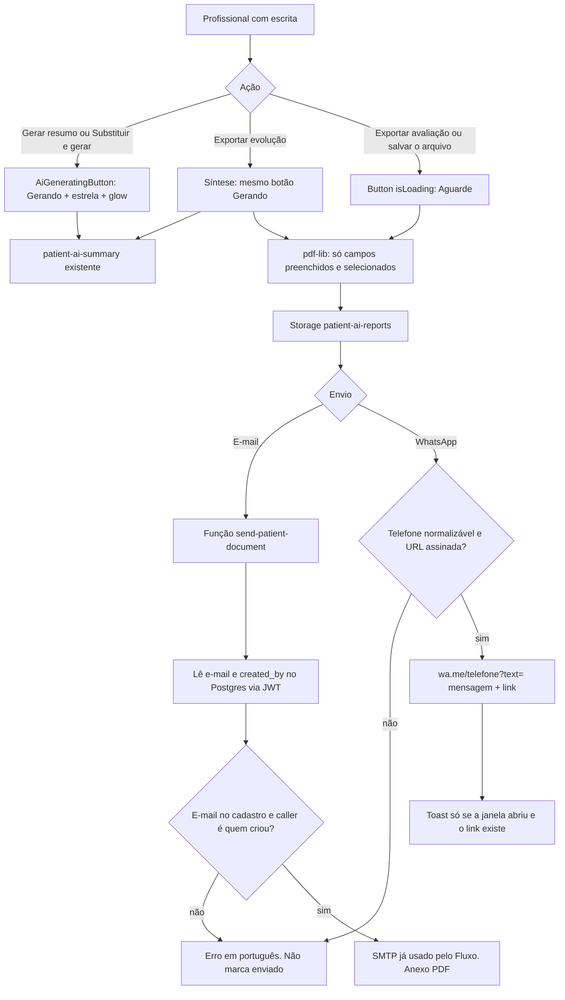

# Phase 26: PDF, botão Gerando e envio ao cliente - Research

**Researched:** 2026-10-06
**Domain:** PDF clínico (pdf-lib), estado visual do botão de IA, e-mail SMTP já configurado no Dashboard, WhatsApp click-to-chat
**Confidence:** HIGH

## Summary

O PDF de avaliação e o de evolução já existem em `src/services/patientAiPdf.service.ts` e o catálogo em `src/lib/pdfFieldCatalog.ts` já omite bloco vazio. O que ainda parece formulário denso é o cromo da fase 14: faixa de capítulo, selo `BLOCO X`, caixinhas marcadas e traço `—` na célula vazia da tabela de mobilidade. Esta fase troca esse cromo por um documento claro, no claro, só com o que foi preenchido, sem inventar frase clínica e sem alterar `toWinAnsiSafe`.

O `Button` global troca o rótulo por spinner e `Aguarde...`. Isso não muda. Só os controles que chamam o modelo ganham a palavra `Gerando`, uma estrela do `lucide-react` já instalado e um glow azul. `Exportar PDF` e o salvar do arquivo continuam com `Aguarde...`. A síntese de evolução, enquanto `generateEvolucaoSynthesis` responde, usa `Gerando`.

O Custom SMTP do Dashboard não envia e-mail arbitrário: ele só alimenta os templates do Supabase Auth. [CITED: https://supabase.com/docs/guides/auth/auth-smtp] Não existe API de Auth para anexar o PDF do paciente, e ligar o Send Email Hook desliga esse SMTP. [CITED: https://supabase.com/docs/guides/auth/auth-hooks/send-email-hook] O caminho que cumpre “o mesmo SMTP, segredo só no Dashboard, sem provedor novo” é uma Edge Function nova, colada no Dashboard, que abre o mesmo host/usuário/senha como segredos da função e anexa o PDF já salvo. O WhatsApp oficial `wa.me` só preenche texto. [CITED: https://faq.whatsapp.com/5913398998672934] A mensagem leva o link assinado do PDF salvo. Sem link que o cliente consiga abrir, a tela não marca envio.

**Primary recommendation:** Reestilizar só o desenho de avaliação e evolução no pdf-lib que já está no app; criar `AiGeneratingButton` sem mexer no `isLoading` do `Button`; enviar o e-mail por uma função nova `send-patient-document` no mesmo SMTP, com destinatário lido do cadastro; abrir `wa.me` com o telefone do cadastro e a URL assinada do arquivo salvo.

<user_constraints>
## User Constraints (from CONTEXT.md)

### Locked Decisions
### PDF só com o preenchido
- O PDF de avaliação e o de evolução passam a ter uma formatação linda, simples e limpa. Hierarquia clara, respiro, identidade Fluxo. Não é um formulário denso e não copia tema escuro.
- Entra no PDF somente informação preenchida. Campo vazio, bloco vazio e linha vazia não aparecem.
- O seletor de campos continua: só o que está preenchido entra na lista, tudo marcado por padrão, e o profissional pode desmarcar o que o cliente não deve ver.
- Não inventar texto clínico para preencher buraco.
- A seta `→` no desenho do PDF continua virando `->` só na string desenhada, porque o WinAnsi troca U+2192 por `?`. Não mudar `toWinAnsiSafe`.

### Botão que usa IA
- Vale para todo controle cuja ação chama o modelo. Hoje isso é **Gerar resumo** e a confirmação **Substituir e gerar**, mais a espera da síntese de evolução enquanto o modelo responde.
- No lugar do spinner e do texto **Aguarde...**, o botão mostra a palavra **Gerando**, uma estrela e o fundo com uma animação de glow azul.
- O brilho azul existe só nesse estado. O resto do Fluxo continua com as cores atuais.
- **Exportar PDF** e o envio do arquivo, quando não há chamada de modelo, não usam Gerando nem a estrela.
- Salvar, excluir e os outros botões do sistema continuam com o carregamento que já têm. Não trocar o `isLoading` global do `Button` para Gerando.
- Com `prefers-reduced-motion`, a palavra e a estrela permanecem e o brilho não fica em loop.

### E-mail e WhatsApp
- Na exportação da avaliação e da evolução há dois botões, um com o logo do WhatsApp e outro com um símbolo de e-mail. O mesmo par aparece em cada PDF já salvo, para reenviar.
- O destino é o e-mail e o telefone que já estão no cadastro do paciente. O profissional não escolhe o contato de novo.
- Sem e-mail, o botão de e-mail não finge que enviou: explica em português que falta o e-mail. Sem telefone, o mesmo para o WhatsApp.
- O e-mail leva o PDF ao endereço do paciente pelo SMTP que o Fluxo já usa. Segredo só no Dashboard. Não criar provedor novo e não gravar senha no repositório.
- O WhatsApp abre a conversa no telefone do paciente e entrega o documento. Se a plataforma não anexar arquivo, a mensagem leva o link do PDF já salvo. Não marcar como enviado se o cliente não tiver como abrir o arquivo.
- Conta sem escrita não vê esses botões.

### Claude's Discretion
- O azul exato do glow, a duração e a curva da animação, desde que o brilho seja azul e fique só no botão que está gerando.
- Se o símbolo de e-mail é um envelope ou outra marca de correio, desde que seja reconhecível ao lado do logo do WhatsApp e não exija pacote novo.
- O texto curto que acompanha o PDF no e-mail e no WhatsApp, em português, sem dado clínico além do que já está no PDF.

### Deferred Ideas (OUT OF SCOPE)
- Fechar o UAT da fase 25.
- Reabrir a formatação dos blocos da ficha na tela.
- Trocar o e-mail de confirmação de conta ou o de redefinição de senha.
- Enviar por outros canais (SMS, Instagram).
</user_constraints>

<phase_requirements>
## Phase Requirements

| ID | Description | Research Support |
|----|-------------|------------------|
| REQ-37 | PDF só com o preenchido, botão Gerando com estrela e brilho azul, envio da avaliação ou evolução por e-mail e WhatsApp | Catálogo e `drawAvaliacao` / `drawEvolucao` já pulam bloco vazio; o plano reestiliza o cromo e tira o traço de célula vazia. `AiGeneratingButton` cobre Gerar resumo, Substituir e gerar e a síntese. E-mail: função nova no SMTP já usado. WhatsApp: `wa.me` + URL assinada. `canWrite === false` esconde os botões. |
</phase_requirements>

## Project Constraints (from .cursor/rules/)

Não há `.cursor/rules/` neste repositório. As restrições abaixo vêm do CONTEXT, do ROADMAP da fase 26 e do pedido desta pesquisa. O plano não as reabre.

- Sem SQL, sem `supabase/migrations`, sem `supabase db push`.
- Sem pacote npm novo no `package.json`. Não subir `lucide-react` nem `pdf-lib`.
- Não editar `patient-ai-summary` (nem a cópia da fase 13, nem a gêmea da fase 11, nem `supabase/functions/`).
- Não usar `supabase functions deploy`. Publicar a função nova colando o fonte no Dashboard, como a fase 22 fez com a função de IA.
- Segredos de e-mail só no Dashboard. Nada de senha, App Password ou token no git.
- Não criar provedor de e-mail novo (Resend, SendGrid, Brevo como produto novo, WhatsApp Business API).
- Não trocar o `isLoading` global de `src/components/ui/Button.tsx`.
- Não inventar texto clínico. Não mudar `toWinAnsiSafe`.
- Conta sem escrita não vê os botões de envio.
- Não fazer push do git, salvo pedido explícito.

## Architectural Responsibility Map

| Capability | Primary Tier | Secondary Tier | Rationale |
|------------|-------------|----------------|-----------|
| Desenho do PDF só com o preenchido | Browser / Client | — | `buildPatientAiReportPdf` já roda no browser com `pdf-lib`. O arquivo sobe depois para o Storage. |
| Catálogo e seletor do que entra no PDF | Browser / Client | — | `buildEvaluationFilledCatalog` / `buildEvolucaoFilledCatalog` e `PatientAiFieldPicker` já decidem os ids. |
| Palavra Gerando, estrela e glow | Browser / Client | — | Estado visual do botão. Não chama rede por si. |
| Salvar o PDF e obter URL assinada | Browser / Client | Database / Storage | `createPatientAiReport` grava no bucket privado `patient-ai-reports`. A URL nasce com `createSignedUrl`. |
| E-mail com anexo ao endereço do cadastro | API / Backend (Edge Function) | Database / Storage | O SMTP do Auth não aceita este envio. A função lê o e-mail na linha do paciente e o PDF no Storage, com o JWT de quem escreve. |
| WhatsApp no telefone do cadastro | Browser / Client | CDN / Static (URL assinada) | `wa.me` só leva texto. O documento chega como link do arquivo já salvo. |
| Esconder envio de quem não escreve | Browser / Client | API / Backend | A UX usa `canWrite`. A função recusa se `patients.created_by` não for o usuário do JWT. Sem SQL novo. |

## Standard Stack

### Core

| Library | Version | Purpose | Why Standard |
|---------|---------|---------|--------------|
| `pdf-lib` | 1.17.1 (instalado; `npm view` também 1.17.1) | Desenhar avaliação e evolução | Já é o desenhador. Helvetica/Times usam WinAnsi. [CITED: https://www.npmjs.com/package/pdf-lib] [VERIFIED: npm registry] |
| `lucide-react` | 1.25.0 instalado | Estrela no botão que gera; envelope no e-mail | `Mail`, `Star` e `Sparkles` existem neste install. [VERIFIED: import local de `lucide-react@1.25.0`] Não publicar a 1.52.0 do registry. |
| `@supabase/supabase-js` | 2.117.1 | `functions.invoke` e `storage.createSignedUrl` | Já usado em `patientAi.service.ts` e `patientAiReports.service.ts`. |
| `denomailer` | 1.6.0 pinado em URL Deno | Cliente SMTP dentro da função, com anexo | Não entra no `package.json`. O 1.6.0 corrige STARTTLS, que o 1.5 quebrou. [CITED: https://deno.land/x/denomailer@1.6.0] [CITED: https://github.com/EC-Nordbund/denomailer/releases] |

### Supporting

| Library | Version | Purpose | When to Use |
|---------|---------|---------|-------------|
| CSS em `src/index.css` | já no app | Glow azul e `prefers-reduced-motion` | Só na classe do botão que está gerando. O bloco reduce do landing já existe na linha 244. |
| SVG inline do WhatsApp | — | Marca do botão | O Lucide deste projeto não é a fonte do logo. Não instalar pacote de ícones de marca. |
| `node:test` | Node v26.4.0 | Contrato do fonte e helpers puros | Sem Vitest. Padrão das fases 21 e 23. |

### Alternatives Considered

| Instead of | Could Use | Tradeoff |
|------------|-----------|----------|
| Função nova no mesmo SMTP | Template Auth ou Send Email Hook | O SMTP do Auth só manda os e-mails de conta. O hook substitui esse SMTP e quebraria a confirmação da fase 15. [CITED: https://supabase.com/docs/guides/auth/auth-hooks/send-email-hook] |
| `wa.me` + link do PDF salvo | WhatsApp Business API ou `navigator.share` com arquivo | API nova é provedor novo, proibido. O share do sistema deixa a pessoa escolher o contato e não abre o telefone do cadastro. |
| `AiGeneratingButton` à parte | Trocar o ramo `isLoading` do `Button` | Mudaria Salvar, Excluir e o restante do Fluxo. Proibido. |
| Reestilizar `drawAvaliacao` e `drawEvolucao` | Pacote de template PDF ou `fontkit` | Pacote novo, e fonte custom furaria o WinAnsi que `toWinAnsiSafe` protege. |

**Installation:**

```bash
# Nenhum. Não rodar npm install nesta fase.
```

**Version verification:** `npm view pdf-lib version` → `1.17.1`. `npm view lucide-react version` → `1.52.0` no registry, mas o install local é `1.25.0` (`node_modules/lucide-react/package.json`). Usar o que já está instalado.

## Package Legitimacy Audit

Esta fase não instala pacote npm. O gate de `slopcheck` não se aplica a uma lista de instalação vazia. `denomailer` não vai para o `package.json`: é um import Deno pinado, no mesmo estilo em que a função de IA já importa `npm:@supabase/supabase-js@2` de dentro do fonte colado no Dashboard.

| Package | Registry | Age | Downloads | Source Repo | slopcheck | Disposition |
|---------|----------|-----|-----------|-------------|-----------|-------------|
| nenhum pacote npm novo | — | — | — | — | não rodou (nada a instalar) | Approved — não instalar |
| `denomailer@1.6.0` | deno.land/x, não npm do app | release 1.6.0 documentada como correção de STARTTLS | — | https://github.com/EC-Nordbund/denomailer | não avaliado pelo slopcheck (não é npm do app) | Usar só como URL pinada na função. Não `npm install`. |

**Packages removed due to slopcheck [SLOP] verdict:** nenhum
**Packages flagged as suspicious [SUS]:** nenhum pacote npm. Não adicionar `nodemailer`, `@fontsource/*`, `fontkit`, `resend` nem SDK de WhatsApp.

## Architecture Patterns

### System Architecture Diagram



### Recommended Project Structure

```
src/
├── components/ui/Button.tsx                         # não mudar o ramo isLoading
├── components/ui/AiGeneratingButton.tsx             # Gerando + estrela + glow
├── components/patients/PatientAiComposer.tsx        # três controles de modelo + par de envio na exportação
├── components/patients/PatientAiReportsList.tsx     # o mesmo par em cada PDF salvo, só se canWrite
├── services/patientAiPdf.service.ts                 # visual simples de avaliação e evolução
├── services/patientDocumentSend.service.ts          # invoke da função + wa.me + checagem de contato
└── lib/patientContact.ts                            # e-mail utilizável e dígitos do WhatsApp

.planning/phases/26-pdf-botao-gerando-envio-cliente/
└── functions/send-patient-document/index.ts         # fonte para colar no Dashboard
```

Não escrever em `.planning/phases/26-pdf-da-extra-o-bonito-e-s-com-o-preenchido-bot-o-gerando-com/`. Esse diretório é sobra. O diretório da fase é `26-pdf-botao-gerando-envio-cliente`.

### Pattern 1: PDF simples, só com o preenchido

**What:** `drawAvaliacao` e `drawEvolucao` deixam o selo de bloco, o banner de capítulo e a caixinha marcada. No lugar: título de seção, rótulo e valor, com espaço vertical, página clara, regra curta na cor de acento já usada (`#2f7dff` em `COLORS.accent`).
**When to use:** Somente `kind: 'avaliacao' | 'evolucao'`. `geral` e `sessao` continuam no desenho atual.
**Example:** o filtro de campo vazio que já existe e deve permanecer:

```typescript
// Source: src/services/patientAiPdf.service.ts — drawTwoColumnFields e drawOptionalField
const filled = fields.filter(([, v]) => textFilled(v))
if (filled.length === 0) return
// drawOptionalField devolve false e não desenha quando o valor é null ou string em branco
```

A tabela de mobilidade (`drawDataTable`, único caller por volta da linha 2210) ainda desenha `—` na célula vazia de uma linha que tem outro lado preenchido. Nessa tabela, célula vazia fica em branco. Linha inteira vazia já é filtrada. Não chamar `wrapLines` com string vazia: `wrapLines` transforma vazio em `—`.

A seta continua assim, e `toWinAnsiSafe` permanece intocado:

```typescript
// Source: src/services/patientAiPdf.service.ts por volta da linha 2197
formatCabecalhoRegiao(regiao, { incluirNome: true }).replaceAll('→', '->')
```

Helvetica e Times Roman não desenham U+2192. O pdf-lib lança se o caractere sair do WinAnsi. [CITED: https://www.npmjs.com/package/pdf-lib]

### Pattern 2: Botão de modelo, sem mexer no Button

**What:** Componente novo. Enquanto `generating` ou a síntese está ativa, mostra `Gerando`, `Star` do Lucide e a classe de glow. Desabilita o clique. Não usa a prop `isLoading`.
**When to use:** O botão `Gerar resumo`; o confirmar de `ConfirmDialog` quando o diálogo é o de substituir o resumo; o botão `Exportar PDF` somente no intervalo de `generateEvolucaoSynthesis`.
**When not to use:** `Exportar PDF` na avaliação (não chama modelo); `createReport.isPending` (grava o arquivo); o confirmar do `PatientAiFieldPicker`; Salvar e Excluir.

O compositor hoje junta as duas esperas num botão só:

```typescript
// Source: src/components/patients/PatientAiComposer.tsx
isLoading={generating || (createReport.isPending && !pickerOpen)}
```

Separar. `generating === true` em `handleGenerate` é modelo. `setGenerating(true)` dentro de `handleExport` no ramo evolução também é modelo (`generateEvolucaoSynthesis`). O ramo avaliação de `handleExport` não liga `generating`. O picker confirma com `isLoading={confirming}` e isso continua `Aguarde...`.

`ConfirmDialog` renderiza `Button` com `isLoading`. Não alterar `Button`. Acrescentar um modo opcional só nesse diálogo, default igual ao de hoje, e o compositor de resumo pede o visual `Gerando` no confirmar.

Glow: usar o azul já do produto (`--color-accent: #2f7dff` em `src/index.css`). Animação só na classe desse botão. No `prefers-reduced-motion`, `animation: none` e um brilho azul estático, para a palavra e a estrela ficarem e o loop parar. O bloco reduce existente não cobre essa classe; incluir a classe nele.

### Pattern 3: E-mail pelo SMTP que o Fluxo já usa

**What:** Função nova, fonte em `.planning/phases/26-pdf-botao-gerando-envio-cliente/functions/send-patient-document/index.ts`, publicada colando no Dashboard → Edge Functions. Segredos no Dashboard → Edge Function Secrets, com os mesmos host, porta, usuário, senha e remetente do Custom SMTP. Nomes não podem começar com `SUPABASE_`. [CITED: https://supabase.com/docs/guides/functions/secrets]
**When to use:** O profissional pede e-mail e o cadastro tem e-mail de verdade.

O cliente manda só `patientId` e `reportId`. Não manda o endereço. A função, com o JWT do usuário (o mesmo `requireUser` + `createClient` anon/publishable da função de IA):

1. Lê `patients.email` e `patients.created_by` daquela linha.
2. Se `created_by` não é o usuário, responde 403 e não envia.
3. Lê a linha `patient_ai_reports` daquele paciente e baixa o objeto no bucket `patient-ai-reports` com o cliente do usuário, não com service role.
4. Se o e-mail da linha é nulo, vazio ou o placeholder `—`, responde erro em português e não abre SMTP.
5. Envia para esse e-mail, anexo `application/pdf`, corpo curto sem queixa, diagnóstico ou trecho da ficha.
6. Fecha o cliente SMTP. Não escreve senha nem bytes do PDF no log.

Porta 465: `tls: true`. Porta 587: `tls: false` para STARTTLS. O runbook da fase 15 aceita as duas. Pin `https://deno.land/x/denomailer@1.6.0/mod.ts`. Anexo em binário, não base64 duplo. [CITED: https://deno.land/x/denomailer@1.6.0]

O limite de 30 e-mails/hora do Auth não se aplica a esta função: esse limite é do servidor de Auth depois do Custom SMTP. [CITED: https://supabase.com/docs/guides/auth/auth-smtp] A cota de quem recebe é a do próprio servidor SMTP (Gmail ou o que estiver no Dashboard).

Não ligar Send Email Hook. Com o hook ligado, o SMTP deixa de enviar a confirmação de conta. [CITED: https://supabase.com/docs/guides/auth/auth-hooks/send-email-hook]

`createPatientAiReport` devolve `signedUrl: null`. O e-mail não precisa da URL: a função baixa pelo `storage_path`. O invoke segue o padrão de `supabase.functions.invoke` em `src/services/patientAi.service.ts`. Toast de sucesso só com resposta 2xx sem `error`.

### Pattern 4: WhatsApp com link do PDF salvo

**What:** `https://wa.me/<digitos>?text=<encodeURIComponent(mensagem)>`. A mensagem leva uma frase curta e a URL assinada. Sem URL, não abre e não marca enviado.
**When to use:** Há telefone normalizável e `createSignedUrl` devolveu URL.

```text
https://wa.me/15551234567?text=urlencodedtext
```

O número é internacional, só dígitos, sem `+`, zero à esquerda, parênteses ou traços. O parâmetro `text` preenche a caixa. Não anexa PDF. [CITED: https://faq.whatsapp.com/5913398998672934]

No clique, criar uma URL nova com `createSignedUrl(path, expiresIn)`. A lista usa `SIGNED_URL_SECONDS = 3600` em `patientAiReports.service.ts`. Para a mensagem, usar uma validade própria de 7 dias (`604800` segundos) e escrever na frase que o link vale 7 dias. A referência JS não publica um teto. [CITED: https://supabase.com/docs/reference/javascript/file-buckets-createsignedurl] Passar `download` com nome `avaliacao.pdf` ou `evolucao.pdf`, sem dado clínico no nome. [CITED: https://supabase.com/docs/reference/javascript/file-buckets-createsignedurl]

`window.open` dessa URL. Se voltar `null`, ou se a URL não existir, toast de erro em português e nenhum toast de sucesso. O sucesso diz que a conversa abriu com o link, não que o aplicativo entregou a mensagem sozinho.

O cadastro guarda o telefone como texto livre (`optionalText(30)`). `mapPatient` transforma nulo em `'—'`. Tratar `—`, vazio e não-dígito como ausência de telefone. O mesmo para o e-mail. Não usar `emergencyPhone`.

Normalização do WhatsApp, recomendada e ainda não travada com o profissional: só dígitos; 10 ou 11 dígitos ganham prefixo `55`; 12 ou 13 começando com `55` ficam como estão; qualquer outro formato explica em português que o telefone não abre no WhatsApp e não marca enviado. [ASSUMED]

### Anti-Patterns to Avoid

- **Trocar `Button` para todo `isLoading` dizer Gerando.** Salvar e excluir mudam juntos.
- **Marcar WhatsApp enviado ao montar o `wa.me` sem URL, ou quando o popup não abre.**
- **Mandar o e-mail do body do invoke.** O destino sai da coluna `patients.email`.
- **Service role para achar o paciente.** Quem consulta a ficha de colega passaria a enviar.
- **`navigator.share({ files })` como envio de WhatsApp.** Não fixa o telefone do cadastro. O painel de imagens usa share para foto; esta fase não copia isso.
- **Editar `patient-ai-summary` para enfiar o SMTP.** A função de IA fica como está.
- **Preencher buraco do PDF com “Não informado”, “Sem dados” ou texto de modelo.**
- **Habilitar o Send Email Hook “para conseguir anexo”.** Isso desliga o SMTP da confirmação de conta.

## Don't Hand-Roll

| Problem | Don't Build | Use Instead | Why |
|---------|-------------|-------------|-----|
| Protocolo SMTP, STARTTLS, MIME e anexo | Socket SMTP na função | `denomailer@1.6.0` | AUTH, quebra de linha e base64 de anexo erram em silêncio. |
| Caracteres fora do WinAnsi | `fontkit` ou fonte embutida | `toWinAnsiSafe` existente, seta já trocada na string desenhada | Pacote novo, e a decisão trava a função. |
| Entrega de arquivo no WhatsApp | Cliente da Cloud API | `wa.me` + URL assinada do PDF salvo | A URL oficial não anexa arquivo. API nova é outro provedor. |
| E-mail transacional “pelo Auth” | Template Confirm signup com link do PDF | Função que fala com o mesmo servidor SMTP | Auth não anexa PDF de paciente e o hook substitui o SMTP. |

**Key insight:** O Dashboard já tem o servidor de e-mail, mas esse servidor não está exposto ao app. A função nova é o único jeito de usar a mesma caixa sem um fornecedor novo e sem senha no repositório.

## Common Pitfalls

### Pitfall 1: Placeholder `—` parece contato
**What goes wrong:** O botão de e-mail “envia” para `—`, ou o WhatsApp abre um número vazio.
**Why it happens:** `mapPatient` faz `email: row.email ?? '—'` e o mesmo com `phone`. [VERIFIED: `src/services/patients.service.ts`]
**How to avoid:** Helper que rejeita nulo, vazio, `—` e e-mail que não passe numa checagem simples. A função de e-mail repete a checagem na linha do banco, não confia no cliente.
**Warning signs:** Toast de sucesso com destinatário `—`.

### Pitfall 2: URL assinada nula logo depois de salvar
**What goes wrong:** O reenvio imediato abre WhatsApp sem link e a UI marca enviado.
**Why it happens:** `createPatientAiReport` retorna `mapReportRow(row, null)`. A URL da lista nasce em `listPatientAiReports`.
**How to avoid:** No clique de WhatsApp, `createSignedUrl` na hora. Se falhar, parar.
**Warning signs:** `signedUrl` null no objeto recém-criado.

### Pitfall 3: Exportar PDF mostra Gerando ao gravar o arquivo
**What goes wrong:** O salvar do blob usa a estrela.
**Why it happens:** Um único `isLoading` cobre síntese e `createReport.isPending`.
**How to avoid:** Estrela só em volta de `generatePatientAiSummary` e `generateEvolucaoSynthesis`.
**Warning signs:** O picker “Confirmar” ou o upload piscando `Gerando`.

### Pitfall 4: Célula `—` e `wrapLines` inventam um traço
**What goes wrong:** O PDF ainda mostra linha ou traço onde o profissional não escreveu.
**Why it happens:** `drawDataTable` usa `'—'` na célula vazia. `wrapLines` faz `text.trim() || '—'`.
**How to avoid:** Não desenhar texto na célula vazia. Não passar string vazia para `wrapLines` no caminho da avaliação/evolução. Não mudar `toWinAnsiSafe`.
**Warning signs:** Mobilidade com `-` no lado que não foi preenchido. U+2014 vira `-` dentro de `toWinAnsiSafe`.

### Pitfall 5: Segredo do Auth não aparece sozinho na função
**What goes wrong:** A função sobe e o SMTP falha porque `SMTP_PASS` está vazio.
**Why it happens:** A senha do Custom SMTP fica na config de Auth. Edge Function secrets são outro lugar. [CITED: https://supabase.com/docs/guides/functions/secrets]
**How to avoid:** Runbook com placeholders. O operador cola host, porta, usuário, senha e remetente nos segredos da função, os mesmos valores do Custom SMTP. Nenhum valor real no markdown.
**Warning signs:** 500 “smtp não configurado” no primeiro e-mail.

### Pitfall 6: Gmail recusa a conexão a partir da função
**What goes wrong:** O mesmo App Password que o Auth usa falha na função.
**Why it happens:** O envio passa a sair da rede do Edge, não do GoTrue. Isso não foi medido nesta pesquisa.
**How to avoid:** UAT com um e-mail real. Se falhar, mostrar o erro em português e não marcar enviado. Não trocar de provedor dentro da fase.
**Warning signs:** Erro de autenticação ou timeout só na função, com o e-mail de confirmação de conta ainda saindo.

### Pitfall 7: Link do WhatsApp é um bearer token
**What goes wrong:** Quem tiver a URL baixa o PDF até ela expirar, sem login.
**Why it happens:** URL assinada de bucket privado não pede sessão. [CITED: https://supabase.com/docs/guides/storage/serving/downloads]
**How to avoid:** Bucket continua privado. Validade escrita na mensagem. Não logar a URL. Não colocar queixa ou nome clínico no texto fora do arquivo.
**Warning signs:** Mensagem com o PDF inteiro colado em texto, ou bucket público.

### Pitfall 8: Diretório de fase duplicado
**What goes wrong:** Plano ou fonte cai na pasta com o nome truncado.
**Why it happens:** Existem `26-pdf-botao-gerando-envio-cliente` e `26-pdf-da-extra-o-bonito-e-s-com-o-preenchido-bot-o-gerando-com`.
**How to avoid:** Tudo desta fase no primeiro caminho. O `init.phase-op` aponta para ele.
**Warning signs:** RESEARCH ou função só na pasta truncada.

## Code Examples

### URL assinada

```js
// Source: https://supabase.com/docs/reference/javascript/file-buckets-createsignedurl
const { data, error } = await supabase.storage
  .from('patient-ai-reports')
  .createSignedUrl(path, 604800, { download: 'avaliacao.pdf' })
```

### Click to chat

```text
https://wa.me/<digitos>?text=<encodeURIComponent(frase curta + url)>
```

Source: [CITED: https://faq.whatsapp.com/5913398998672934]

### SMTP com anexo na função

```ts
// Source: https://deno.land/x/denomailer@1.6.0
import { SMTPClient } from 'https://deno.land/x/denomailer@1.6.0/mod.ts'

const port = Number(Deno.env.get('FLUXO_SMTP_PORT') ?? '587')
const client = new SMTPClient({
  connection: {
    hostname: Deno.env.get('FLUXO_SMTP_HOST') ?? '',
    port,
    tls: port === 465,
    auth: {
      username: Deno.env.get('FLUXO_SMTP_USER') ?? '',
      password: Deno.env.get('FLUXO_SMTP_PASS') ?? '',
    },
  },
})

await client.send({
  from: Deno.env.get('FLUXO_SMTP_FROM') ?? '',
  to: emailDoCadastro,
  subject: kind === 'evolucao' ? 'Sua evolução' : 'Sua avaliação',
  content: 'Segue o documento da sua fisioterapia, em anexo.',
  attachments: [
    {
      filename: kind === 'evolucao' ? 'evolucao.pdf' : 'avaliacao.pdf',
      contentType: 'application/pdf',
      encoding: 'binary',
      content: pdfBytes,
    },
  ],
})
await client.close()
```

O texto exato do assunto e do corpo fica na discrição do plano, em português, sem dado clínico além do anexo. Nomes dos segredos são sugestão: não começar com `SUPABASE_`.

### Glow que não entra em loop

```css
/* Azul do produto: src/index.css --color-accent #2f7dff */
.ai-generating {
  background-color: #2f7dff;
  color: #fff;
  animation: ai-glow 1.6s ease-in-out infinite;
}
@keyframes ai-glow {
  0%, 100% { box-shadow: 0 0 0 0 rgba(47, 125, 255, 0.35); }
  50% { box-shadow: 0 0 16px 4px rgba(47, 125, 255, 0.55); }
}
@media (prefers-reduced-motion: reduce) {
  .ai-generating {
    animation: none;
    box-shadow: 0 0 12px 2px rgba(47, 125, 255, 0.45);
  }
}
```

## State of the Art

| Old Approach | Current Approach | When Changed | Impact |
|--------------|------------------|--------------|--------|
| SMTP de demonstração do Supabase, 2 e-mails/hora, só para o time | Custom SMTP no Dashboard para os e-mails de Auth | Fase 15, runbook `docs/ops/auth-email-smtp.md` | A caixa Fluxo já existe. Ela não envia o PDF sozinha. |
| PDF da ficha com selo de bloco e banner de capítulo | Documento leve, só campos preenchidos | Esta fase, em cima do pdf-lib 1.17.1 | Avaliação e evolução mudam o desenho. Geral e sessão não. |
| `wa.me` só com texto | `wa.me` com texto e link do arquivo salvo | Ajuda atual do WhatsApp | Continua sem anexo. O link é a entrega. [CITED: https://faq.whatsapp.com/5913398998672934] |

**Deprecated/outdated:**

- Send Email Hook como atalho para “usar o SMTP do Fluxo”: ele passa a ser o enviador dos e-mails de Auth e o SMTP deixa de ser usado. [CITED: https://supabase.com/docs/guides/auth/auth-hooks/send-email-hook]
- `supabase functions deploy` e `supabase db push`: o CLI não está instalado. O caminho hospedado é o Dashboard.

## Assumptions Log

| # | Claim | Section | Risk if Wrong |
|---|-------|---------|---------------|
| A1 | Telefone com 10 ou 11 dígitos é do Brasil e recebe o prefixo `55`. | Pattern 4 | Um número estrangeiro abre a conversa errada. O plano deve falhar em português em vez de marcar enviado quando o formato não for esses dois casos. |
| A2 | Validade de 7 dias na URL do WhatsApp é aceitável para o paciente abrir o arquivo. | Pattern 4 | Se o operador quiser outra janela, só muda `expiresIn` e a frase. A referência não documenta um máximo. |
| A3 | O mesmo App Password do Custom SMTP autentica a partir da rede da Edge Function. | Pitfall 6 | O primeiro e-mail real falha. A fase não troca de provedor; o UAT mostra o erro. |
| A4 | Assunto “Sua avaliação” / “Sua evolução” e corpo “Segue o documento da sua fisioterapia, em anexo.” bastam. | Code Examples | Discrição do CONTEXT. Trocar a frase não muda a arquitetura. |

## Open Questions

1. **O Gmail (ou o SMTP que estiver no Dashboard) aceita conexão vinda da Edge Function?**
   - What we know: O Auth já usa esse SMTP para confirmação de conta. A função é outro cliente, na rede do Supabase.
   - What's unclear: Não houve envio real nesta pesquisa.
   - Recommendation: UAT humano com um paciente de teste. Falha vira erro em português, sem sucesso falso e sem provedor novo.

2. **A URL assinada tem teto de segundos?**
   - What we know: `expiresIn` é obrigatório, em segundos. O exemplo oficial usa 60 e o guia usa 3600. [CITED: https://supabase.com/docs/reference/javascript/file-buckets-createsignedurl]
   - What's unclear: A página não declara máximo.
   - Recommendation: 7 dias na mensagem de WhatsApp. Se a API recusar, cair para 24 horas e dizer isso na frase. Sem URL, não marcar enviado.

## Environment Availability

| Dependency | Required By | Available | Version | Fallback |
|------------|------------|-----------|---------|----------|
| Node.js | `node --test`, typecheck | ✓ | v26.4.0 | — |
| `pdf-lib` | Desenho do PDF | ✓ | 1.17.1 | — |
| `lucide-react` | Estrela e envelope | ✓ | 1.25.0 | — |
| Custom SMTP no Dashboard | E-mail ao paciente | não verificável daqui | runbook da fase 15 | Sem senha no repo. UAT no Dashboard. |
| Supabase CLI | Publicar função | ✗ | — | Colar o fonte no Dashboard. Não usar `functions deploy`. |
| Deno local | Rodar a função na máquina | ✗ | — | Contrato por `node --test` lendo o fonte. Execução é o hosted. |

**Missing dependencies with no fallback:**

- Nenhuma para o código do app. O e-mail real depende do operador copiar o SMTP para os segredos da função nova.

**Missing dependencies with fallback:**

- Supabase CLI e Deno: publicação e UAT no Dashboard, teste de contrato no Node.

Step 2.6 auditou CLI, Node e as bibliotecas já instaladas. O SMTP em si não tem como ser sondado sem o segredo.

## Validation Architecture

`workflow.nyquist_validation` está ausente em `.planning/config.json` e conta como ligado. Não há script `npm test` nem Vitest. O harness é `node:test`, como em `src/lib/mobilidadePalpacao.test.ts`.

### Test Framework

| Property | Value |
|----------|-------|
| Framework | `node:test` + `node:assert/strict` (Node v26.4.0) |
| Config file | nenhum — sem instalar framework |
| Quick run command | `node --test src/lib/patientContact.test.ts src/lib/phase26Contract.test.ts` |
| Full suite command | `node --test src/lib/patientContact.test.ts src/lib/phase26Contract.test.ts src/lib/mobilidadePalpacao.test.ts && npm run typecheck` |

### Phase Requirements → Test Map

| Req ID | Behavior | Test Type | Automated Command | File Exists? |
|--------|----------|-----------|-------------------|-------------|
| REQ-37.1 | PDF de avaliação/evolução não desenha campo vazio; `toWinAnsiSafe` intacto; seta vira `->` na string desenhada; tabela não usa `'—'` como valor | unit (contrato de fonte + helper) | `node --test --test-name-pattern "REQ-37.1" src/lib/phase26Contract.test.ts` | ❌ Wave 0 |
| REQ-37.2 | `Button.tsx` ainda tem `Aguarde...` e o spinner. O visual `Gerando` + `Star` mora no componente novo. Exportar avaliação e o confirmar do picker não usam esse componente | unit (contrato de fonte) | `node --test --test-name-pattern "REQ-37.2" src/lib/phase26Contract.test.ts` | ❌ Wave 0 |
| REQ-37.3 | E-mail sai da função, destino lido do cadastro, anexo PDF. WhatsApp é `wa.me` com URL. Logos: SVG do WhatsApp e `Mail` | unit (contrato de fonte) | `node --test --test-name-pattern "REQ-37.3" src/lib/phase26Contract.test.ts` | ❌ Wave 0 |
| REQ-37.4 | Sem e-mail ou sem telefone utilizável, helper recusa e a cópia explica em português | unit | `node --test src/lib/patientContact.test.ts` | ❌ Wave 0 |
| REQ-37.5 | `PatientAiReportsList` só desenha os botões de envio com `canWrite`. O compositor já retorna `null` sem escrita. A função compara `created_by` | unit (contrato de fonte) | `node --test --test-name-pattern "REQ-37.5" src/lib/phase26Contract.test.ts` | ❌ Wave 0 |
| REQ-37.3 | E-mail chega na caixa e o WhatsApp abre no telefone com o link | manual (UAT) | Abrir a ficha, exportar, enviar | Sem browser harness no `node:test` |

### Sampling Rate

- **Per task commit:** `npm run typecheck` e, quando o arquivo existir, `node --test src/lib/patientContact.test.ts src/lib/phase26Contract.test.ts`
- **Per wave merge:** o comando full suite acima
- **Phase gate:** full suite verde antes de `/gsd-verify-work`, mais o UAT do e-mail real e do `wa.me`

### Wave 0 Gaps

- [ ] `src/lib/patientContact.test.ts` — REQ-37.4, prefixo `55`, rejeição de `—`
- [ ] `src/lib/phase26Contract.test.ts` — REQ-37.1, REQ-37.2, REQ-37.3, REQ-37.5, lendo fonte com `readFileSync` como `mobilidadePalpacao.test.ts` já faz com `toWinAnsiSafe`
- [ ] Framework install: nenhum

O teste de `toWinAnsiSafe` que já existe em `src/lib/mobilidadePalpacao.test.ts` precisa continuar passando. Não editar o corpo dessa função.

## Security Domain

`security_enforcement` não está em `.planning/config.json` e conta como ligado.

### Applicable ASVS Categories

| ASVS Category | Applies | Standard Control |
|---------------|---------|-----------------|
| V2 Authentication | yes | JWT no `Authorization` da função, no padrão de `requireUser` da função de IA. Sem sessão nova. |
| V3 Session Management | no | A sessão Supabase atual permanece. |
| V4 Access Control | yes | UX: `canWritePatient` esconde os botões. Função: `patients.created_by` igual ao usuário do JWT. RLS continua sendo a parede de leitura. Cliente do usuário, sem service role. |
| V5 Input Validation | yes | Zod no body: `patientId` e `reportId` apenas. E-mail e telefone não vêm do cliente. E-mail da linha conferido de novo na função. |
| V6 Cryptography | yes | URL assinada do Storage. SMTP com TLS na 465 ou STARTTLS na 587. Não inventar cifra. |

### Known Threat Patterns for este envio

| Pattern | STRIDE | Standard Mitigation |
|---------|--------|---------------------|
| Destinatário escolhido no body (enviar a ficha para um atacante) | Information disclosure | `to` só de `patients.email`. Ignorar e-mail no JSON. |
| Colega com leitura dispara a função | Elevation | 403 se `created_by` não é o caller. Os botões nem aparecem. |
| PDF de outro paciente via `reportId` | Tampering | A linha do relatório tem de ser daquele `patient_id`. Download com o JWT, não com service role. |
| Senha SMTP no repositório ou no log | Information disclosure | Segredos só no Dashboard. Log sem senha, sem URL assinada e sem bytes do PDF. |
| URL do WhatsApp repassada | Information disclosure | Bucket privado, validade curta e dita na mensagem. Texto da mensagem sem conteúdo clínico. |
| Send Email Hook “para anexar” | Denial of service no Auth | Não configurar o hook. A confirmação de conta continua no Custom SMTP. |
| Marcar enviado sem arquivo alcançável | Repudiation | Sucesso de e-mail só no 2xx da função. Sucesso de WhatsApp só com URL e `window.open` não nulo. |

## Sources

### Primary (HIGH confidence)

- https://supabase.com/docs/guides/auth/auth-smtp — Custom SMTP é o enviador dos e-mails de Auth; limite de 30/hora é desse servidor
- https://supabase.com/docs/guides/auth/auth-hooks/send-email-hook — hook ligado substitui o SMTP
- https://supabase.com/docs/guides/functions/secrets — segredos da função no Dashboard; prefixo `SUPABASE_` reservado
- https://supabase.com/docs/reference/javascript/file-buckets-createsignedurl — `expiresIn` em segundos e opção `download`
- https://supabase.com/docs/guides/storage/serving/downloads — bucket privado e URL assinada como bearer até expirar
- https://faq.whatsapp.com/5913398998672934 — `wa.me` com número internacional e `?text=`
- https://www.npmjs.com/package/pdf-lib — Standard fonts WinAnsi; caractere fora do conjunto lança
- https://deno.land/x/denomailer@1.6.0 — SMTPClient, anexo binário, `tls` versus STARTTLS
- https://github.com/EC-Nordbund/denomailer/releases — 1.6.0 corrige STARTTLS quebrado no 1.5

### Secondary (MEDIUM confidence)

- Código atual: `patientAiPdf.service.ts`, `pdfFieldCatalog.ts`, `PatientAiComposer.tsx`, `PatientAiReportsList.tsx`, `Button.tsx`, `patients.service.ts`, `patientAiReports.service.ts`, `patientAi.service.ts`, `accountAccess.ts`, `docs/ops/auth-email-smtp.md`
- Import local: `lucide-react@1.25.0` exporta `Mail`, `Star` e `Sparkles`

### Tertiary (LOW confidence)

- Nenhuma decisão travada apoia só em busca solta. O prefixo `55` e a janela de 7 dias estão no Assumptions Log.

## Metadata

**Confidence breakdown:**

- Standard stack: HIGH — bibliotecas já instaladas e documentos oficiais do SMTP, do Storage e do WhatsApp
- Architecture: HIGH — o desenho segue o código atual e a restrição de não criar provedor
- Pitfalls: HIGH para placeholder, URL nula e `isLoading`; MEDIUM para o Gmail aceitar a função

**Research date:** 2026-10-06
**Valid until:** 2026-11-05 (SMTP e WhatsApp estáveis; rever se o Dashboard mudar o modelo de segredos)

## RESEARCH COMPLETE
