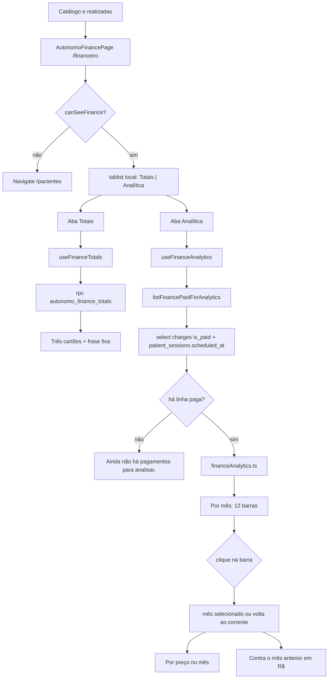

# Phase 27: Analítica no Financeiro - Research

**Researched:** 2026-10-09
**Domain:** Agregação no cliente dos pagamentos já gravados + gráficos SVG na seção Totais de `/financeiro`
**Confidence:** HIGH

<user_constraints>
## User Constraints (from CONTEXT.md)

### Locked Decisions

### Duas abas
- A troca fica só na seção que hoje se chama Totais. Catálogo e realizadas continuam abaixo, sempre visíveis.
- Os nomes das abas são exatamente `Totais` e `Analítica`.
- `Totais` mostra os três cartões de hoje: Este mês, Este ano e Sempre, com a frase `Soma das sessões pagas, inclusive pré-pagas agendadas.`
- A aba escolhida fica na tela. Não vira rota nova.

### Analítica
- Três visões, simples:
  1. **Por mês** — barras do arrecadado nos últimos 12 meses, do mais antigo ao mais novo.
  2. **Por preço** — quanto entrou em cada nome de preço. Avulso sem nome de catálogo aparece como `Avulso`.
  3. **Contra o mês anterior** — o mês selecionado ao lado do mês imediatamente anterior, os dois em R$.
- O conjunto é o mesmo dos totais: cobrança com pago, inclusive sessão ainda agendada que já foi pré-paga. Não usar só as sessões com status realizada.
- Sem pagamento, a Analítica não desenha gráfico vazio nem número inventado. Mostra `Ainda não há pagamentos para analisar.`

### Interação
- Passar o mouse ou focar um ponto mostra o rótulo e o valor em R$.
- Clicar uma barra de mês seleciona esse mês. Por preço e Contra o mês anterior passam a falar desse mês.
- Sem clique, o mês selecionado é o mês corrente.
- Clicar de novo a mesma barra volta para o mês corrente.
- Com `prefers-reduced-motion`, os gráficos continuam e não animam.

### Claude's Discretion
- A forma exata da barra e do destaque do mês selecionado, desde que o gráfico seja simples, use as cores já do Fluxo e não pareça um painel de outro produto.
- Se Por preço, no mês selecionado, vira lista com barra ou barras horizontais, desde que o hover e o valor em R$ existam.
- O texto curto do tooltip, em português, sem dado de paciente.

### Deferred Ideas (OUT OF SCOPE)
- Exportar a analítica em PDF ou planilha.
- Meta de faturamento, despesa, imposto ou lucro.
- Filtrar por paciente.
- Mudar o significado de Este mês, Este ano e Sempre.
</user_constraints>

<phase_requirements>
## Phase Requirements

| ID | Description | Research Support |
|----|-------------|------------------|
| REQ-38 | Analítica no Financeiro — duas abas nos totais, com gráficos simples e interativos. Aceite: abas Totais e Analítica; arrecadado por mês, mistura por preço e comparação com o mês anterior; hover/foco em R$ e clique que seleciona o mês; mesmos pagamentos dos totais, inclusive pré-pago agendado, sem mock; empresa e fisioterapeuta continuam sem Financeiro; sem SQL novo e sem pacote novo. | Abas só em `AutonomoFinancePage`, estado local. Leitura paginada de `autonomo_session_charges` pagas com `patient_sessions.scheduled_at` embutido. Agregação pura em `src/lib/financeAnalytics.ts` no fuso `America/Sao_Paulo`. SVG no padrão de `ActivityChart`, sem `FinancePage.tsx` e sem `canSeeFinance` alterado. |
</phase_requirements>

## Summary

Os três cartões já somam certo no Postgres: `autonomo_finance_totals()` faz `SUM` de `autonomo_session_charges.amount_brl` onde `is_paid`, junta `patient_sessions` e corta o mês/ano com `scheduled_at AT TIME ZONE 'America/Sao_Paulo'`. Não filtra `status`. A lista de realizadas faz o contrário: `status = 'realizada'` e `created_by`. A Analítica tem de seguir a função, não a lista. A data não está na cobrança útil para o gráfico; a coluna que o SQL usa é `patient_sessions.scheduled_at`. [VERIFIED: `.planning/phases/05-financeiro-autonomo/sql/05-autonomo-finance.sql`] [VERIFIED: `src/services/finance.service.ts`]

Não há RPC de série mensal e esta fase não cria SQL. A série nasce no cliente: ler as cobranças pagas que o RLS já entrega, embutir só `scheduled_at`, paginar de 1000 em 1000, e agregar numa função pura. O gráfico é SVG com as cores do tema (`accent` `#2f7dff`, `forest` `#0b1d36`, `line` `#e1e8f0`), no mesmo espírito de `ActivityChart`. `SalesChart` é a tela bakery (fundo escuro, barra em div, atraso de animação) e não serve. Nenhum pacote novo.

**Primary recommendation:** Manter `fetchFinanceTotals` e os três cartões. Acrescentar `listFinancePaidForAnalytics` + `src/lib/financeAnalytics.ts`. Na seção Totais de `AutonomoFinancePage`, um `tablist` local troca os cartões pelas três visões empilhadas. Catálogo e realizadas ficam fora das abas.

## Project Constraints (from .cursor/rules/)

Não há `.cursor/rules/` neste repositório. O brief da fase e o CONTEXT travam o mesmo conjunto:

- Sem SQL, sem `supabase/migrations`, sem `supabase db push`. Só leitura das tabelas que já existem.
- Sem pacote npm novo. Gráfico em SVG, como `ActivityChart` em `src/pages/DashboardPage.tsx`.
- UI em português. Não editar `src/pages/FinancePage.tsx`.
- Cobrança paga inclui sessão pré-paga ainda agendada. A data é `patient_sessions.scheduled_at`.
- Não mudar o significado de Este mês, Este ano e Sempre, o catálogo, a lista de realizadas nem `canSeeFinance`.
- Convenções já do código: aspas simples, sem ponto e vírgula, `function` nomeada, classes com `[...].join(' ')`, tokens de `src/index.css`, página → hook → service, erro via `mapDbError`, `formatCurrency` em `src/lib/security/index.ts`. [VERIFIED: `.planning/codebase/CONVENTIONS.md`]

## Architectural Responsibility Map

| Capability | Primary Tier | Secondary Tier | Rationale |
|------------|-------------|----------------|-----------|
| Abas Totais / Analítica e mês selecionado | Browser / Client | — | Estado de tela. Não é rota, não é coluna. |
| Os três totais de hoje | Database / Storage | Browser / Client | Continuam em `autonomo_finance_totals()`. O cliente só formata. |
| Série, mistura por preço e comparação | Browser / Client | Database / Storage | Não existe função de série. O Postgres só entrega as linhas que o RLS já permite. A soma é no cliente. |
| Quem vê Financeiro | Browser / Client | Database / Storage | `canSeeFinance` redireciona. A autoridade continua o RLS de `autonomo_session_charges` (dono + `account_type = 'autonomo'`). |
| Catálogo e lista de realizadas | Browser / Client | Database / Storage | Fora da aba. Não reutilizar `listFinanceRealizadas` como fonte da Analítica. |

## Standard Stack

### Core

| Library | Version | Purpose | Why Standard |
|---------|---------|---------|--------------|
| react | 19.2.7 (resolvido; `package.json` `^19.1.0`) | Abas, SVG, estado do mês | Já desenha `ActivityChart` e a página do financeiro. [VERIFIED: `package.json`] [VERIFIED: `.planning/codebase/STACK.md`] |
| @tanstack/react-query | 5.101.2 (`^5.76.1`) | Cache da leitura nova | `invalidateFinance` já invalida toda chave que começa com `['finance']`. [CITED: https://tanstack.com/query/v5/docs/framework/react/guides/query-invalidation] |
| @supabase/supabase-js | 2.117.1 (pin) | `select` + embed + `range` | Cliente único do app. Sem RPC nova. [VERIFIED: `package.json`] |
| Intl.DateTimeFormat | runtime do browser e do Node 26 | Mês em `America/Sao_Paulo` | A opção `timeZone` existe desde 2017. `Date#getMonth()` usa o fuso da máquina. [CITED: https://developer.mozilla.org/en-US/docs/Web/JavaScript/Reference/Global_Objects/Intl/DateTimeFormat/DateTimeFormat] |

### Supporting

| Library | Version | Purpose | When to Use |
|---------|---------|---------|-------------|
| node:test + node:assert/strict | Node v26.4.0 | Teste da agregação pura | O helper não pode importar `@/`. Mesmo harness de `src/lib/sessionSeries.test.ts`. [VERIFIED: `node --version`] |
| typescript | ~5.8.3 | `npm run typecheck` | Já é o gate do projeto. Sem Vitest. |

### Alternatives Considered

| Instead of | Could Use | Tradeoff |
|------------|-----------|----------|
| SVG próprio | `recharts`, `d3`, `visx` | Proibido. Pacote novo e visual de outro produto. |
| Leitura das tabelas atuais | RPC `autonomo_finance_analytics()` | Proibido. SQL novo. |
| `listFinanceRealizadas` | — | Errado. Essa lista corta `status = 'realizada'` e omite pré-pago agendado. |
| `SalesChart` | — | Barras em `div`, tema escuro da confeitaria, animação com atraso. Não é o Fluxo. |

**Installation:**

```bash
# nenhum pacote
```

**Version verification:** nada a publicar no registry. Versões acima são as já instaladas no `package.json` / STACK.md e o Node medido nesta sessão (`v26.4.0`).

## Package Legitimacy Audit

Esta fase não instala pacote. O gate slopcheck não se aplica.

| Package | Registry | Age | Downloads | Source Repo | slopcheck | Disposition |
|---------|----------|-----|-----------|-------------|-----------|-------------|
| — | — | — | — | — | — | Nenhum pacote novo |

**Packages removed due to slopcheck [SLOP] verdict:** none
**Packages flagged as suspicious [SUS]:** none

## Architecture Patterns

### System Architecture Diagram



### Recommended Project Structure

```text
src/
├── lib/financeAnalytics.ts            # mês SP, 12 meses, soma por nome, mês anterior
├── lib/financeAnalytics.test.ts       # node:test, import relativo .ts, sem @/
├── services/finance.service.ts        # listFinancePaidForAnalytics (leitura)
├── hooks/useFinance.ts                # useFinanceAnalytics, chave ['finance', 'analytics', userId]
├── components/finance/FinanceAnalyticsCharts.tsx  # SVG das três visões
└── pages/AutonomoFinancePage.tsx      # só o tablist no lugar dos três cartões
```

Não criar arquivo em `src/pages/FinancePage.tsx`. Não criar pasta `supabase/`.

### Pattern 1: Abas só na seção Totais

**What:** `useState<'totais' | 'analitica'>` na página. `role="tablist"` + `role="tab"` + `aria-selected` + `aria-controls`, como `PatientProfileHeader`. Painel Totais é o bloco que já existe (três `<article>` e a frase). Catálogo e “Sessões realizadas” continuam seções irmãs, sempre montadas.
**When to use:** Sempre. Sem `useSearchParams`, sem rota, sem `localStorage`.
**Example:** copiar o botão de aba de `src/components/patients/PatientProfileHeader.tsx` (`min-h-11`, `border-b-2`, ativo `border-forest text-forest`). Rótulos literais `Totais` e `Analítica`.

### Pattern 2: Leitura do mesmo conjunto do RPC

**What:** Uma página PostgREST de cobranças pagas com a sessão embutida. O embed `!inner` descarta cobrança cuja sessão o RLS não deixa ver — o mesmo corte do `JOIN` da função. Não pedir `patients(full_name)` nem `status`.
**When to use:** A query da Analítica. Não na lista de realizadas.
**Example:**

```typescript
// Source: https://docs.postgrest.org/en/stable/references/api/resource_embedding.html
// e https://supabase.com/docs/reference/javascript/select (teto padrão de 1000; range pagina)
const PAGE = 1000
const { data, error } = await supabase
  .from('autonomo_session_charges')
  .select('id, price_name, amount_brl, is_paid, patient_sessions!inner(scheduled_at)')
  .eq('is_paid', true)
  .order('id', { ascending: true })
  .range(from, from + PAGE - 1)
```

Repetir enquanto a página voltar com 1000 linhas. Parar na página curta. `amount_brl` chega como `number | string`; converter na borda, como `mapCharge`.

O FK já está no script da fase 5: `session_id uuid not null unique references public.patient_sessions (id)`. Há um único FK para `patient_sessions`, então o hint `patient_sessions!inner(...)` basta. [VERIFIED: SQL da fase 5] [CITED: docs.postgrest.org resource embedding]

### Pattern 3: Mês civil em America/Sao_Paulo

**What:** Chave `YYYY-MM` pelo fuso nomeado, não por `getMonth()`.
**When to use:** Toda barra, o mês corrente inicial e o mês anterior.
**Example:**

```typescript
// Source: MDN Intl.DateTimeFormat timeZone
// https://developer.mozilla.org/en-US/docs/Web/JavaScript/Reference/Global_Objects/Intl/DateTimeFormat/DateTimeFormat
const ZONE = 'America/Sao_Paulo'

export function saoPauloMonthKey(iso: string, now = new Date(iso)): string {
  const parts = new Intl.DateTimeFormat('en-US', {
    timeZone: ZONE,
    year: 'numeric',
    month: '2-digit',
  }).formatToParts(now)
  const year = parts.find((part) => part.type === 'year')?.value
  const month = parts.find((part) => part.type === 'month')?.value
  if (!year || !month) throw new Error('Data inválida')
  return `${year}-${month}`
}
```

Medido nesta sessão: `2026-04-01T02:30:00.000Z` é `2026-03-31 23:30` em `America/Sao_Paulo`. `getUTCMonth()` devolve abril. A máquina local também é `America/Sao_Paulo`, então um teste que use `getMonth()` passa aqui e mente num runner em UTC. [VERIFIED: `node` nesta sessão]

Os 12 meses são doze chaves civis, da mais antiga à atual, inclusive meses com soma zero. Deslocar a chave com aritmética de ano/mês (`índice = ano * 12 + mês - 1`), não com `setMonth` num `Date` local. O mês anterior da primeira barra pode cair fora da janela: a leitura traz todo o histórico pago, e a janela de 12 é só o desenho.

Soma em centavos: `Math.round(Number(amountBrl) * 100)`, depois divide por 100 na hora de exibir. A coluna é `numeric(12, 2)`. Somar `number` solto diverge do `SUM` numérico por centavo.

`Por preço` agrupa `price_name` já gravado (snapshot). Nome vazio vira `Avulso`. Ordenar por centavos decrescente e, no empate, `localeCompare` com `'pt-BR'`.

### Pattern 4: Três visões empilhadas, um mês selecionado

**What:** Na aba Analítica as três visões aparecem juntas. Por mês é o gráfico clicável. Por preço e Contra o mês anterior leem o mês selecionado. Não são sub-rotas.
**When to use:** Sempre que existir ao menos um pagamento.
**Example:**

```typescript
function onMonthBar(key: string, currentKey: string, selected: string): string {
  return selected === key ? currentKey : key
}
```

Clicar a barra do mês corrente de novo permanece no corrente. Tooltip e `aria-label`: `março de 2026 · R$ 1.200,00` ou `Avulso · R$ 180,00`, via `formatCurrency`. Sem nome de paciente.

Por preço: barras horizontais em SVG (discrição). Contra o mês anterior: duas barras verticais, rótulo do mês e valor em R$. Sem percentual. O chip `monthDelta` do dashboard é outra superfície.

Mês selecionado com soma zero, mas com pagamentos em outros meses: desenhar a barra zero e, em Por preço, a frase `Nenhum pagamento neste mês.` Não usar a frase global de vazio, e não inventar preço. A frase global só quando a lista paga vem vazia.

### Pattern 5: SVG sem animação

**What:** `viewBox` fixo, `preserveAspectRatio="xMidYMid meet"`, como `ActivityChart`. Barra do mês não selecionado com `fill-accent`. Barra selecionada com `fill-forest`. Grade `stroke` `#e1e8f0`. Cada barra é focável: `role="button"`, `tabIndex={0}`, `onMouseEnter` / `onMouseLeave`, `onFocus` / `onBlur`, `onClick`, Enter e Espaço. Área de clique maior que a barra quando o valor é zero (o círculo transparente de raio 14 do `ActivityChart` é o análogo).
**When to use:** As três visões.
**Anti-padrão visual:** classe `dash-line` (`stroke-dashoffset` anima em `src/index.css`), `transition-all duration-200` do ponto do dashboard, e o `--bar-delay` de `SalesChart`. O `@media (prefers-reduced-motion: reduce)` já zera `.dash-in` e `.dash-line`. Gráfico novo não entra nessa animação: simplesmente não anima. [VERIFIED: `src/index.css`]

### Anti-Patterns to Avoid

- **Reusar `listFinanceRealizadas`:** corta realizadas e perde pré-pago agendado.
- **Filtrar `status` na leitura nova:** o RPC não filtra. `agendada` paga entra.
- **`Date#getMonth()` / `formatDate` sem `timeZone`:** `formatDate` em `src/lib/security/index.ts` não passa fuso. Perto da meia-noite UTC a barra cai no mês errado e briga com “Este mês”.
- **Select sem `range`:** o projeto Supabase devolve no máximo 1000 linhas por padrão. O `SUM` do RPC não tem esse teto. [CITED: https://supabase.com/docs/reference/javascript/select]
- **`SalesChart` ou biblioteca de chart:** outro produto, ou pacote novo.
- **Tooltip com paciente:** a decisão proíbe. O `select` não pede `full_name`.
- **Invalidar com `exact: true` numa chave nova fora de `['finance']`:** as mutations já chamam `invalidateQueries({ queryKey: ['finance'] })`, que pega o prefixo. A chave nova tem de ser `['finance', 'analytics', userId]`. Não reescrever cada mutation. [CITED: https://tanstack.com/query/v5/docs/framework/react/guides/query-invalidation] [VERIFIED: `src/hooks/useFinance.ts`]

## Don't Hand-Roll

| Problem | Don't Build | Use Instead | Why |
|---------|-------------|-------------|-----|
| Os três totais | Outro `SUM` no cliente para os cartões | `fetchFinanceTotals` / `autonomo_finance_totals()` | O significado de Este mês, Este ano e Sempre fica no SQL. |
| R$ | `toFixed` ou outro `Intl` | `formatCurrency` | pt-BR / BRL já fechado na fase 5. |
| Fuso do mês | `getMonth()`, `date-fns`, pacote de TZ | `Intl.DateTimeFormat` com `timeZone: 'America/Sao_Paulo'` | API da plataforma. Sem pacote. |
| Gráfico | Eixos, escala e tooltip de biblioteca | SVG no padrão de `ActivityChart` | Decisão travada. |
| Autorização | Checagem nova de papel | `canSeeFinance` + RLS existente | Empresa e fisio já não leem a tabela. |
| Página de 1000+ | Assumir que a lista cabe num `select()` | `.range` até página curta, `order('id')` | Sem `order`, a página repete ou pula linha. |

**Key insight:** o número certo já está definido no SQL da fase 5. A fase 27 só fatia o mesmo conjunto. Qualquer filtro de status, fuso local ou teto de 1000 linhas faz a barra mentir em relação ao cartão.

## Common Pitfalls

### Pitfall 1: Lista de realizadas como fonte
**What goes wrong:** Pré-pago agendado some da Analítica e o mês fica menor que “Este mês”.
**Why it happens:** `listFinanceRealizadas` filtra `status = 'realizada'` e `created_by`.
**How to avoid:** Ler `autonomo_session_charges` com `is_paid = true` e a data da sessão. Não filtrar status.
**Warning signs:** Sessão agendada marcada paga muda o cartão e não muda a barra.

### Pitfall 2: Mês no fuso da máquina
**What goes wrong:** Instante `2026-04-01T02:30:00.000Z` cai em abril no UTC e em março em São Paulo. O RPC usa março.
**Why it happens:** `AT TIME ZONE 'America/Sao_Paulo'` converte o `timestamptz` para o relógio de parede e o `date_trunc` corta esse relógio. `getMonth()` corta o relógio local do processo. [VERIFIED: SQL da fase 5, comentário do bucket] [VERIFIED: medição `Intl` nesta sessão]
**How to avoid:** `formatToParts` com `timeZone: 'America/Sao_Paulo'` para a chave, para o rótulo e para “mês corrente”.
**Warning signs:** Teste verde só com `TZ=America/Sao_Paulo`. Esta máquina já está nesse fuso (`Intl` resolve `America/Sao_Paulo`), então o teste obrigatório é a chave do instante acima, não o `getMonth()` local.

### Pitfall 3: Teto de 1000 linhas
**What goes wrong:** “Sempre” cresce e a Analítica para no milésimo pagamento.
**Why it happens:** Supabase aplica `max-rows` 1000 quando o cliente não pagina. [CITED: https://supabase.com/docs/reference/javascript/select]
**How to avoid:** `.order('id').range(from, from + 999)` até uma página menor que 1000.
**Warning signs:** A soma das barras dos 12 meses mais o resto do histórico não chega perto de Sempre numa conta com muitas sessões pagas.

### Pitfall 4: Centavo binário
**What goes wrong:** A barra mostra R$ 0,01 a mais ou a menos que a soma dos snapshots.
**Why it happens:** `numeric(12, 2)` é exato; `number` não é.
**How to avoid:** Somar centavos inteiros e formatar no fim.
**Warning signs:** Dois pagamentos de R$ 10,10 viram algo que não é R$ 20,20.

### Pitfall 5: Gráfico vazio animado ou com zero inventado
**What goes wrong:** Sem nenhum pago, aparecem doze barras em R$ 0,00, ou um skeleton que anima.
**Why it happens:** A janela de 12 meses existe mesmo sem linhas.
**How to avoid:** Lista paga vazia → só o texto `Ainda não há pagamentos para analisar.` Sem `<svg>`. Com linhas, mês zerado é zero real e pode aparecer na janela.
**Warning signs:** A frase global aparece quando o mês corrente está zerado mas setembro teve pagamento.

### Pitfall 6: Hover sem foco, ou foco que anima
**What goes wrong:** Teclado não mostra o valor. Ou `prefers-reduced-motion` ainda desenha o traço.
**Why it happens:** `ActivityChart` só tem `onMouseEnter` e a classe `dash-line` anima.
**How to avoid:** `onFocus` / `onBlur` e `aria-label` com o mesmo texto do tooltip. Sem classe `dash-line` e sem `transition` de altura.
**Warning signs:** Tab atravessa o gráfico sem anúncio do valor.

### Pitfall 7: Embed que pede paciente
**What goes wrong:** Tooltip ou payload traz o nome.
**Why it happens:** `listFinanceRealizadas` já faz `patients(full_name)`.
**How to avoid:** Colunas da cobrança + `patient_sessions!inner(scheduled_at)` apenas.
**Warning signs:** Resposta de rede com `full_name`.

### Pitfall 8: Erro da Analítica derruba os cartões
**What goes wrong:** Falha na leitura nova esconde Este mês / Este ano / Sempre e o catálogo.
**Why it happens:** A página hoje junta `pricesError || totalsError` num único bloco.
**How to avoid:** Erro e loading da Analítica ficam no painel da aba. Totais, catálogo e realizadas seguem nos seus estados atuais.
**Warning signs:** Desligar a rede na aba Analítica troca a página inteira pela frase “Não foi possível carregar o financeiro.”

## Code Examples

### Bucket que a barra tem de imitar

```sql
-- Source: .planning/phases/05-financeiro-autonomo/sql/05-autonomo-finance.sql
-- Não criar outra função. Este é o contrato do mês.
date_trunc('month', s.scheduled_at AT TIME ZONE 'America/Sao_Paulo')
  = date_trunc('month', now() AT TIME ZONE 'America/Sao_Paulo')
-- e o always_total não olha status:
coalesce(sum(c.amount_brl) filter (where c.is_paid), 0)
```

### Tooltip do gráfico que já existe

```tsx
// Source: src/pages/DashboardPage.tsx — ActivityChart
// Trocar o texto de sessões por formatCurrency. Acrescentar foco.
// Não copiar className="dash-line" nem transition-all.
<text textAnchor="middle" className="fill-white text-[10px] font-medium">
  {active.value} {active.value === 1 ? 'sessão' : 'sessões'}
</text>
```

### Invalidação que já cobre a chave nova

```typescript
// Source: src/hooks/useFinance.ts
function invalidateFinance(qc: ReturnType<typeof useQueryClient>) {
  void qc.invalidateQueries({ queryKey: ['finance'] })
}
```

## State of the Art

| Old Approach | Current Approach | When Changed | Impact |
|--------------|------------------|--------------|--------|
| `date_trunc(text, timestamptz, text)` com 3 argumentos | `scheduled_at AT TIME ZONE 'America/Sao_Paulo'` e `date_trunc` de 2 argumentos | Fase 5, comentário A1 no SQL | O cliente repete esse relógio de parede. Não “corrigir” o RPC. |
| Gráfico de atividade só com mouse | Barra com mouse e foco, sem animação | Esta fase | `ActivityChart` não ganha foco de graça. |

**Deprecated/outdated:**
- `FinancePage.tsx` e `SalesChart`: financeiro da confeitaria. Não editar, não reutilizar.
- Pacote de chart: fora do produto.

## Assumptions Log

| # | Claim | Section | Risk if Wrong |
|---|-------|---------|---------------|
| A1 | No mês selecionado sem pagamento, com histórico não vazio, a visão Por preço mostra `Nenhum pagamento neste mês.` em vez da frase global. | Pattern 4 | O profissional pode preferir só a ausência de barras, sem frase extra. A frase global continua reservada ao conjunto vazio. |
| A2 | Duas barras verticais em “Contra o mês anterior”, sem frase de variação percentual. | Pattern 4 | A decisão pede os dois valores em R$. Um texto “mais” / “menos” seria enfeite. Se o plano quiser uma palavra, ela não pode substituir os dois R$. |

## Open Questions

1. **Nome do relacionamento no PostgREST**
   - What we know: O SQL cria um único FK `session_id → patient_sessions(id)`. A documentação aceita `tabela!inner(colunas)`.
   - What's unclear: O nome interno do constraint no banco aplicado pode exigir hint `patient_sessions!autonomo_session_charges_session_id_fkey` se o schema cache não achar o embed.
   - Recommendation: Tentar `patient_sessions!inner(scheduled_at)`. Se a API responder que não achou o relacionamento, cair para duas leituras no estilo de `listFinanceRealizadas` (charges pagas paginadas, depois `patient_sessions.id, scheduled_at` com `.in` em blocos). Não criar FK novo.

## Environment Availability

| Dependency | Required By | Available | Version | Fallback |
|------------|------------|-----------|---------|----------|
| Node.js | `node --test` e o app | ✓ | v26.4.0 | — |
| npm | scripts já existentes | ✓ | 12.0.2 | — |
| `Intl` + `America/Sao_Paulo` | Chave do mês | ✓ | medido nesta sessão | — |
| Supabase já configurado no app | Leitura das tabelas | ✓ (cliente no código) | `@supabase/supabase-js` 2.117.1 | Sem banco nesta pesquisa; o plano não aplica SQL |
| Vitest / Playwright | — | ✗ | — | `node --test` do helper puro |

**Missing dependencies with no fallback:**
- Nenhuma.

**Missing dependencies with fallback:**
- Runner de DOM ausente de propósito. Hover, foco e abas ficam para verificação manual no `/financeiro`. Não instalar Vitest.

## Validation Architecture

`workflow.nyquist_validation` está ausente em `.planning/config.json`. Tratado como ligado.

### Test Framework

| Property | Value |
|----------|-------|
| Framework | `node:test` + `node:assert/strict` (Node v26.4.0). Sem Vitest. |
| Config file | `tsconfig.json`. Nenhum config de `node:test`. |
| Quick run command | `node --test src/lib/financeAnalytics.test.ts && npm run typecheck` |
| Full suite command | `node --test src/lib/*.test.ts && npm run typecheck && npm run lint` |

### Phase Requirements → Test Map

| Req ID | Behavior | Test Type | Automated Command | File Exists? |
|--------|----------|-----------|-------------------|-------------|
| REQ-38 | `2026-04-01T02:30:00.000Z` → chave `2026-03` | unit | `node --test src/lib/financeAnalytics.test.ts` | ❌ Wave 0 |
| REQ-38 | 12 chaves, da mais antiga à corrente, mês zerado permanece | unit | mesmo arquivo | ❌ Wave 0 |
| REQ-38 | Soma em centavos; `price_name` vazio vira `Avulso`; nomes iguais somam | unit | mesmo arquivo | ❌ Wave 0 |
| REQ-38 | Pré-pago entra; status não é argumento da função pura | unit | mesmo arquivo | ❌ Wave 0 |
| REQ-38 | Segundo clique na mesma chave volta à chave corrente | unit | mesmo arquivo | ❌ Wave 0 |
| REQ-38 | Conjunto vazio não produz barras | unit | mesmo arquivo | ❌ Wave 0 |
| REQ-38 | Abas, SVG, hover/foco, RLS, frase na tela | manual | Abrir `/financeiro` como autônomo; empresa/fisio continuam em `/pacientes` | manual-only — não há runner de DOM e instalar um é pacote novo |

O helper exporta funções puras `(linhas, agora) => visões`. O teste passa `agora` fixo. Não ler `new Date()` dentro do teste sem injetar o relógio.

### Sampling Rate

- **Per task commit:** `node --test src/lib/financeAnalytics.test.ts && npm run typecheck`
- **Per wave merge:** `node --test src/lib/*.test.ts && npm run typecheck && npm run lint`
- **Phase gate:** Suíte verde antes de `/gsd-verify-work`, mais a checagem manual das abas no navegador

### Wave 0 Gaps

- [ ] `src/lib/financeAnalytics.ts` — agregação pura, sem `@/`
- [ ] `src/lib/financeAnalytics.test.ts` — cobre REQ-38 no que é função pura
- [ ] Framework install: nenhum

## Security Domain

### Applicable ASVS Categories

| ASVS Category | Applies | Standard Control |
|---------------|---------|-----------------|
| V2 Authentication | no | Sessão Supabase já exigida por `ProtectedRoute`. Sem login novo. |
| V3 Session Management | no | Sem cookie nem token novo. |
| V4 Access Control | yes | UX: `canSeeFinance` intacto. Autoridade: policy `autonomo_session_charges_select` (`owner_id = auth.uid()` e `account_type = 'autonomo'`) e `patient_sessions_select` via `private.can_read_patient`. [VERIFIED: SQL fases 5 e 3] |
| V5 Input Validation | yes | Não há texto livre na query. `is_paid` é booleano. `price_name` vai para `<text>` / `aria-label`, nunca `dangerouslySetInnerHTML`. |
| V6 Cryptography | no | Sem segredo nem hash novo. |

### Known Threat Patterns for this SPA + Supabase

| Pattern | STRIDE | Standard Mitigation |
|---------|--------|---------------------|
| Nome do paciente no payload da Analítica | Information disclosure | `select` sem `full_name`. Tooltip só com mês ou nome de preço e R$. |
| Empresa/fisio lê cobrança pela API | Information disclosure | RLS já devolve zero linhas. A página continua com `Navigate`. Não alargar a policy. |
| Select sem teto | Denial of service | `range` de 1000. Não subir `max-rows` no painel. |
| Soma no cliente gravada de volta | Tampering | A Analítica só lê. Sem `update` / `upsert` novo. |
| Mês vindo da URL | Tampering | Mês selecionado é estado React, não query string. |

## Sources

### Primary (HIGH confidence)

- `.planning/phases/05-financeiro-autonomo/sql/05-autonomo-finance.sql` — totais, fuso, `is_paid`, FK `session_id`, RLS da cobrança
- `.planning/phases/03-tipos-de-conta-e-equipe/sql/03-account-types-team.sql` — `patient_sessions_select` / `can_read_patient`
- `src/services/finance.service.ts` — `fetchFinanceTotals`, `listFinanceRealizadas` (o que não copiar)
- `src/pages/AutonomoFinancePage.tsx` — seção Totais, cartões, frase
- `src/pages/DashboardPage.tsx` — `ActivityChart`
- `src/index.css` — tokens e `prefers-reduced-motion`
- `src/hooks/useFinance.ts` — prefixo `['finance']`
- https://docs.postgrest.org/en/stable/references/api/resource_embedding.html — `!inner`
- https://supabase.com/docs/reference/javascript/select — teto de 1000 e `range`
- https://developer.mozilla.org/en-US/docs/Web/JavaScript/Reference/Global_Objects/Intl/DateTimeFormat/DateTimeFormat — `timeZone`
- https://tanstack.com/query/v5/docs/framework/react/guides/query-invalidation — prefixo de `queryKey`
- Medição local: `2026-04-01T02:30:00.000Z` → `2026-03-31 23:30` em `America/Sao_Paulo`

### Secondary (MEDIUM confidence)

- `.planning/codebase/STACK.md` e `CONVENTIONS.md` — versões e estilo (análise de 2026-09-14, conferida com `package.json` para React, supabase-js, TanStack e TypeScript)

### Tertiary (LOW confidence)

- Nenhuma decisão de produto ficou só em busca web.

## Metadata

**Confidence breakdown:**
- Standard stack: HIGH — nada novo; versões lidas do repo e do Node local
- Architecture: HIGH — SQL, service, página e gráfico lidos nesta sessão
- Pitfalls: HIGH — fuso medido; teto de 1000 citado na doc do Supabase; o corte `realizada` está no service

**Research date:** 2026-10-09
**Valid until:** 2026-11-08 (estável; sem dependência nova)
