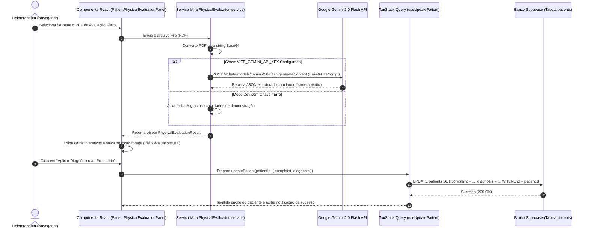

# Documentação do Fluxo de IA e Integração com Supabase

Este documento detalha o funcionamento ponta a ponta da funcionalidade de **Avaliação Física em PDF com Inteligência Artificial** no sistema **ProjetoFisio**, incluindo o fluxo de dados, a integração com a API do Google Gemini 2.0 Flash e o comportamento de escrita no banco de dados do Supabase.

---

## 1. Visão Geral da Arquitetura



---

## 2. Detalhamento Técnico do Fluxo

### Etapa 1: Leitura do Arquivo no Navegador
- **Componente:** `PatientPhysicalEvaluationPanel.tsx`
- **Ação:** O usuário faz upload ou solta um arquivo `.pdf`.
- **Validação:** O sistema confirma o tipo MIME (`application/pdf`) e ativa o estado `isAnalyzing = true`, exibindo o indicador visual de carregamento.

### Etapa 2: Codificação em Base64 e Chamada da IA
- **Arquivo:** `aiPhysicalEvaluation.service.ts`
- **Função:** `fileToBase64(file)` converte o PDF binário em uma representação texto Base64.
- **Chamada HTTP:** É feita uma requisição `POST` para o modelo `gemini-2.0-flash`:
  - **Endpoint:** `https://generativelanguage.googleapis.com/v1beta/models/gemini-2.0-flash:generateContent?key=${apiKey}`
  - **Payload Multimodal:** Envia o prompt de especialista + o buffer Base64 com o tipo de mídia `application/pdf`.
  - **Configuração de Resposta:** `response_mime_type: "application/json"` obriga o Gemini a retornar o laudo estritamente em formato JSON estruturado.

### Etapa 3: Estruturação dos Dados Extraídos
O JSON retornado pela IA é mapeado para a interface `PhysicalEvaluationResult`:
- **`summary`**: Resumo executivo da avaliação.
- **`mainComplaint`**: Queixa principal e histórico de dor.
- **`postureAndMovement`**: Desvios posturais e amplitude de movimento (ADM).
- **`muscleForceAndTests`**: Força muscular (0 a 5) e testes específicos.
- **`cinesiologicDiagnosis`**: Diagnóstico Cinesiológico Funcional final.
- **`suggestedTreatmentPlan`**: Plano de condutas e frequência de atendimentos.
- **`suggestedGoals`**: Objetivos terapêuticos recomendados.

### Etapa 4: Exibição e Armazenamento Local
- O resultado é exibido em cards organizados na aba **Avaliação Física**.
- O histórico de avaliações enviadas para aquele paciente é salvo no `localStorage` do navegador com a chave:
  `fisio.evaluations.${patientId}`
- Permite alternar e comparar avaliações físicas antigas e novas sem perder os dados.

---

## 3. Comportamento no Supabase

Quando o profissional clica em **"Aplicar Diagnóstico ao Prontuário"**, o sistema executa a mutação `useUpdatePatient()`.

### Tabela Afetada: `patients`

| Coluna no Supabase | Tipo no Banco | Conteúdo Atualizado | Origem no PDF |
| :--- | :--- | :--- | :--- |
| **`complaint`** | `text` | Queixa Principal do Paciente | Campo `mainComplaint` gerado pela IA |
| **`diagnosis`** | `text` | Diagnóstico Cinesiológico Funcional | Campo `cinesiologicDiagnosis` gerado pela IA |

### Execução no Backend Supabase (`patients.service.ts`):
```typescript
export async function updatePatient(id: string, input: UpdatePatientInput): Promise<void> {
  const payload = {
    complaint: input.complaint,
    diagnosis: input.diagnosis,
  }

  const { error } = await supabase
    .from('patients')
    .update(payload)
    .eq('id', id)

  if (error) throw new Error(error.message)
}
```

### Revalidação Automática de Cache (TanStack Query)
Após o `UPDATE` bem-sucedido no Supabase, a mutation invalida as seguintes chaves de cache:
- `['patient', patientId]` (Ficha do paciente)
- `['patient-dashboard', patientId]` (Painel "Entenda o Caso")
- `['patients']` (Lista geral de pacientes)

Isso garante que o novo diagnóstico apareça instantaneamente na aba **Resumo** e no painel **Entenda o Caso** da clínica, sem precisar dar *F5* na página.

---

## 4. Configuração do Ambiente (.env)

Para usar a API real do Google Gemini em produção ou dev:

No arquivo `.env`:
```env
VITE_GEMINI_API_KEY=sua_chave_do_google_ai_studio
```

*Nota: Se a variável `VITE_GEMINI_API_KEY` não for informada, o sistema ativa automaticamente um gerador gracioso de simulação para permitir testes sem depender da chave.*
